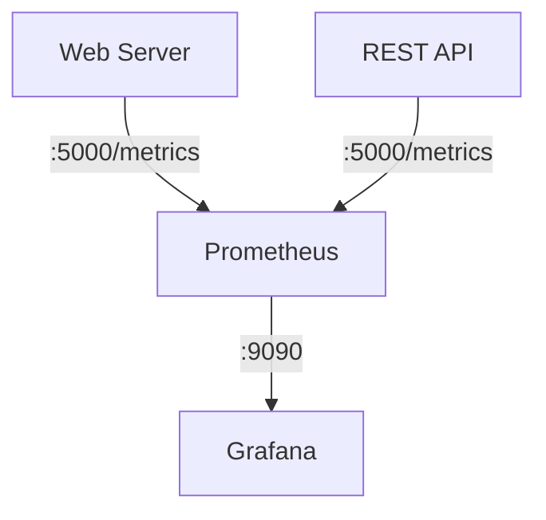
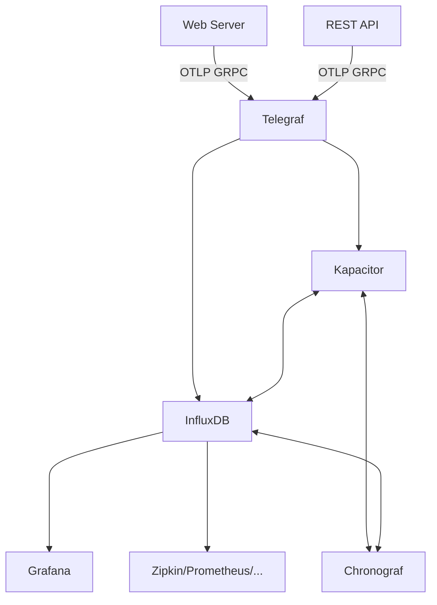

# Introduction

While developing it may be useful to have a setup which mirrors your final production setup as close as possible. In practice, hardware and/or time are not always available on time to setup a test or acception environment which mirrors production. Therefore, having a setup that you can easily (re-)deploy on a (local) virtual environment may be your way out.  

This project contains *Ansible* scripts to setup *Proxmox* and/or *Azure* VMs/containers to install a web site on prem or in the cloud to ease/speed-up development. The *Ansible* scripts in this project assume that you need servers to host the following roles:

* Web Server
* Cache
* Database
* Identity Server  
* REST API endpoints
* Prometheus monitoring
* Grafana dashboards

## Contents

* [Prerequisites](#prerequisites)
* [Proxmox](#proxmox)
* [Azure](#azure)
* [Redis](#redis)
* [Database](#database)
* [Identity Server](#identity-server)
* [REST API endpoints](#rest-api)
* [Prometheus Server](#prometheus-server)
* [Grafana Server](#grafana-server)
* [References](#references)
* [TODO](#todo)

## Prerequisites

### Proxmox prerequisites

If you'd like to deploy on Proxmox, first install Proxmox on a host. Your host is a bare metal machine or a virtual machine with nesting enabled. [Qemu](https://www.qemu.org/) For instance, allows to nest VMs. **TBC**  

Depending on your particular installation and/or test requirements, it may be relevant to configure an *DNS* server during the *Proxmox* installation: this will ensure that the machine running *Proxmox* (bare metal or VM) and the VMs running on *Proxmox* all are in the same subnet.

In this document/config it is assumed that you will use the following domain(s):

```text
# the ip address of the machine that (will) run(s) your web site, for example the ip address of proxmox vm 100
192.168.1.60 cars.be
```

Add the entries above in the hosts file on

* the machine running the Ansible installation scripts
* the clients you use to visit the web site

If all has gone well, you should have (after running the *Ansible* scripts) a setup like:


#### Hyper-V install

You can install Proxmox on Windows Hyper-V. Create the virtual machine with the standard procedure and execute the following command in Powershell

```Powershell
Set-VMProcessor -VMName <Name of your Proxmox VM> -ExposeVirtualizationExtensions $true
``` 

to switch on Hyper-V's nested virtualization. Download and mount the Proxmox ISO, after booting, click in the VM screen and tap on Enter to start the install. If your install hangs at `Trying to detect country`, disable your internet connection and restart the installer.  

After installing Proxmox on Hyper-V, you will notice that calling an endpoint on your Hyper-V VM from WSL2 doesn't work. Open the Hyper-V Manager and next the Virtual Switch Manager


and not the two different virtual switches. As documented [on](https://techcommunity.microsoft.com/t5/itops-talk-blog/windows-subsystem-for-linux-2-addressing-traffic-routing-issues/ba-p/1764074) we need to enable forwarding across both virtual switches:

```Powershell
Get-NetIPInterface | where {$_.InterfaceAlias -eq 'vEthernet (Default Switch)' -or $_.InterfaceAlias -eq 'vEthernet (WSL (Hyper-V firewall))'} | Set-NetIPInterface -Forwarding Enabled
```

:fire: Note the **vEthernet(...)** in the IP interface aliases, if you are not sure about the aliases, first run

```Powershell
Get-NetIPInterface
```

and check the second column.  

#### Bare metal install

Follow the default installation procedure [on](https://www.proxmox.com/en/proxmox-virtual-environment/get-started).

#### Promox API user

Before using the Ansible scripts, you will need a Proxmox API user:
* Log into the Proxmox Web UI
* Select datacenter from the left menu
* Select users from the left sub-menu
* We will use the default root@pam user
* Select API tokens from the left sub-menu
* Click add
    * User: root@pam
    * Token ID: input a random string, for [example](https://www.random.org/passwords/?num=1&len=24&format=plain&rnd=new) and record the token ID
    * record the token secret

After adding the user and API token, select Datacenter and click on Permissions and Add API Token Permission. Choose
* Path: /
* API Token: root@pam<tokenID>
* Role: Administrator
* Propagate: select

### Azure prerequisites

TODO

### Ansible prerequisites

As we are using [Ansible](https://www.ansible.com/) to automate our install and deploy, you will have to meet the following minimum requirements on the hosts which will run the *Ansible* scripts: [Ansible minimum requirements](https://docs.ansible.com/ansible/latest/collections/community/general/proxmox_module.html).

For this project, we will need some extra dependencies. Install the following *Ansible* role(s):

```bash
ansible-galaxy install geerlingguy.redis
```

:fire: Microsoft has an ansible SQL Server role which supports RHEL, as we use Ubuntu for now, the Microsoft Ansible SQL Server role is not usable.

or write all dependencies to a `requirements.yml` file

```yaml
---
roles:
  - name: geerlingguy.redis
    type: galaxy
    source: https://galaxy.ansible.com

collections:
  # With just the collection name
  - my_namespace.my_collection    
```

and install with:

```bash
ansible-galaxy role install -r requirements.yml #what we use
ansible-galaxy collection install -r requirements.yml
```

Add additional Python dependencies with:

```bash
pip install proxmoxer
```

### Secrets prerequisites

Secrets are stored in env variables in files

* .env
* .env.prod
* .env.acc
* .env.dev

Keep your *PROD*, *ACC* and *DEV* secrets in the corresponding files and copy to `.env` before you start the ansible scripts. `source` .env Before executing your first Ansible script.

:fire: Obviously, none of the `env` files belongs in your repo.

Your `env` file should at least contain your public key to connect with ssh to the VMs:

```bash
#!/bin/bash
export SSH_PUB_KEY="ssh-rsa AAAAB.... your_name@your_machine"
```

If you are unsure about your public key, check `~/.ssh/id_rsa_pub`.

## Proxmox

### Proxmox VM setup

As far as I know, *Ansible* is not the tool of choice to setup *VM*s on cloud/datacenter solutions like *Azure*, *Proxmox*, etc. Nevertheless, as an excercise, I've chosen to setup my *Azure* and *Proxmox* *VM*s with *Ansible*.  

*Ansible* Uses an `inventory` to define the machines (*ip addresses*) and machine roles to install/setup your software infrastructure. As we start with a clean install (no existing *VM*s), it is rather difficult to define an `inventory`.  

Therefore, we start with a play `proxmox.cars.be` which has a [vars file](./playbooks/proxmox.cars.be/vars/main.yml) defining the *inventory*, for example:

```yml
proxmox_vms:
 - ip: 192.168.1.60
   id: 600
   group:
    - "webserver"
 - ip: 192.168.1.61
   id: 601
   group:
    - "redis"
 - ip: 192.168.1.62
   id: 602
   group:
    - "database"
```

On the other hand, it is probably wise to structure/group *ip addresses* and *vm id*s under `group:` which is more aligned with an *Ansible inventory* (and easier to maintain). :fire: That's for another version.  

After running the [proxmox.cars.be](./playbooks/proxmox.cars.be/) play, we can use the initialized *VM*s as defined in the [vars file](./playbooks/proxmox.cars.be/vars/main.yml) as the basis for the *Ansible* `ìnventory`.  

Running the [proxmox.cars.be](./playbooks/proxmox.cars.be/) play is detailed in [Uploading templates](###uploading-proxmox-vm(s)-templates) and [Installing VMs on Proxmox](###installing-proxmox-vm(s)).  

The [hosts](./playbooks/hosts) file contains the `inventory` for the other *Ansible* plays. :fire: At this moment, the [hosts](./playbooks/hosts) file is not generated from the [proxmox.cars.be](./playbooks/proxmox.cars.be/) play, it is probably a good idea to change that in future versions.  

### Proxmox hosts file

You can pass a hosts file to the `ansible-playbook` command with:

```bash
-i ./hosts
```

### Uploading Proxmox VM(s) templates

```bash
ansible-playbook proxmox_ubuntu_vm-setup.yml -K --tags=vm_upload -vvv
```

:fire: If this tag fails, you may have to upgrade your community.general modules, see [issue](https://github.com/ansible-collections/community.general/issues/6974):

```bash
ansible-galaxy collection install community.general
```

you should have at least version 7.2.1

```bash
ansible-galaxy collection list
```

and look for community.general.

:fire: You probably have two installs of community.general, if you'd like to run the system-wide install:

```bash
sudo ansible-galaxy collection install community.general
```

### Installing Proxmox VM(s)

```bash
ansible-playbook proxmox_ubuntu_vm-setup.yml -K --tags=vm_init -vvv
```

### Addding Proxmox VM(s) to known_hosts

If you removed existing VMs/Containers or are building new VMs/Containers, you should remove the old entries in `known_hosts` and add new entries:

```bash
ANSIBLE_HOST_KEY_CHECKING=false ansible-playbook knowhosts-setup.yml -i hosts -K -vvv
```

When you observe an additional line being added to your known_hosts file after connecting to a server via SSH, even after manually adding the server's fingerprint with ssh-keyscan or with `ansible-playbook knowhosts-setup.yml`, it typically relates to how SSH handles and verifies the identity of the servers it connects to. Here are a few reasons why this might happen:

1. Different Key Types  
If you initially add the server's `ED25519` key fingerprint to your known_hosts using ssh-keyscan -H -t ed25519 ip_address, but the server is also configured to use another type of SSH key (e.g., RSA, ECDSA), the SSH client might add the fingerprint of this additional key to the known_hosts file upon the first connection. This occurs because your initial scan and add operation only included the ED25519 key, and upon connection, SSH automatically adds any other keys presented by the server that weren't already in known_hosts.

2. Hostname and IP Address Entries  
Another common reason is the difference in how you reference the server in your ssh command versus what was initially scanned. For instance, if you scanned the IP address and then used the hostname (or vice versa) to connect, SSH treats these as separate entries. SSH distinguishes between IP addresses and hostnames because they can technically present different keys (consider virtual hosts or shared IP scenarios). As a result, SSH might add a new line for the same server under its different identifier (IP or hostname).

3. SSH Configuration and Aliases  
Your SSH client's configuration might influence how known_hosts is managed. For example, if you use an SSH config file (~/.ssh/config) with aliases or specific host entries that define hostname patterns or specific key types, your SSH client might treat connections that match different patterns as distinct, even if they ultimately resolve to the same server.

4. Port Forwarding or Jump Hosts  
If your connection involves port forwarding or using a jump host (also known as a bastion host), the SSH client may add entries for these intermediate steps. This is more likely in complex networking setups where direct connections to the target server are not possible without going through intermediary servers.

Troubleshooting Tips:

* Review the known_hosts file: Compare the entries before and after the connection. Look for differences in the key types, hostnames/IP addresses, or additional details that might explain the new entry.
* Use verbose mode with SSH: Connecting with `ssh -v root@ip_address` can provide detailed logs that explain what keys are being checked, offered, and added to known_hosts. This might give you a clearer picture of why the additional line is added.
* Check SSH client configuration: Review your SSH client's configuration file (if you have one) for any settings that might affect how known_hosts entries are managed or how connections are established.

Understanding the exact reason requires examining the specifics of your SSH setup, the server configuration, and the entries in known_hosts.

For our particular setup, we can edit the server config `sshd_config` file on the server we connect to to enforce the usage of `ED25519` keys:

```ini
#HostKey /etc/ssh/ssh_host_rsa_key
#HostKey /etc/ssh/ssh_host_ecdsa_key
HostKey /etc/ssh/ssh_host_ed25519_key
KexAlgorithms curve25519-sha256,curve25519-sha256@libssh.org
PubkeyAcceptedKeyTypes ssh-ed25519
```

in addition, make sure that folder `/run/sshd` exists on the server:

```bash
mkdir /run/sshd
chmod 0755 /run/sshd
systemctl restart sshd
```

Clients, however, should now support `ED25519`, i.e. use:

```bash
ssh-keygen -t ed25519 -C you@cars.be
```

If you now connect with:

```bash
ssh -v root@192.168.1.68
```

you will notice in the output that ssh will attempt different keys, for example:

```text
debug1: Will attempt key: /home/you/.ssh/id_rsa RSA SHA256:....
debug1: Will attempt key: /home/you/.ssh/id_ecdsa
debug1: Will attempt key: /home/you/.ssh/id_ecdsa_sk
debug1: Will attempt key: /home/you/.ssh/id_ed25519 ED25519 SHA256:....
debug1: Will attempt key: /home/you/.ssh/id_ed25519_sk
debug1: Will attempt key: /home/you/.ssh/id_xmss
debug1: Will attempt key: /home/you/.ssh/id_dsa
```

To conclude, the server decides about the security of the keys used by the client, therefore, we will configure all sshd daemons for `ED25519`:  

```bash
ansible-playbook sshdserver_setup.yml -i hosts --user root -K -vvv
```

:fire: User root is specified with `--user root`: the hosts we connect to have the `ED25519` key under `/root/.ssh/authorized_keys`, so we have to connect as `root` to use this key.  

### Stopping Proxmox VM(s)

```bash
ansible-playbook proxmox_ubuntu_vm-setup.yml -K --tags=vm_stop -vvv
```

### Starting Proxmox VM(s)

```bash
ansible-playbook proxmox_ubuntu_vm-setup.yml -K --tags=vm_start -vvv
```

if necessary, you can restart with

```bash
ansible-playbook proxmox_ubuntu_vm-setup.yml -K --tags=vm_restart -vvv
```

### Removing Proxmox VM(s)

Before removing a Proxmox VM, first stop the Proxmox VM, so execute the [stopping proxmox](#stopping-proxmox-vms) command or add tag vm_stop before the *vm_remove* tag in the following command:

```bash
ansible-playbook proxmox_ubuntu_vm-setup.yml -K --tags=vm_stop,vm_remove -vvv
```

### SSH into the Proxmox VM

```bash
ssh root@192.168.1.60 -i /home/user/.ssh/authorized_keys
```

## Azure

TODO

## Redis

### Install Redis

```bash
ansible-playbook redis-setup.yml -i hosts -K -vvv
```

:fire: Note the `hosts` file, at the moment, only ip address are used in the host file. In an ideal case, hostnames as setup on *Proxmox* should be used grouped by labels redis, webserver, etc.

:fire: If you get an error like

```bash
 "msg": "Unable to start service redis-server: Job for redis-server.service failed because the control process exited with error code.\nSee \"systemctl status redis-server.service\" and \"journalctl -xe\" for details.\n"
```

after running the redis playbook, you probably forgot to `source .env`.  

## Identity Server

### Install Identity Server

`ABP` supports [IdentityServer4](https://github.com/IdentityServer/IdentityServer4) and [OpenIddict](https://github.com/openiddict/openiddict-core). As the `ABP` startup templates support *OpenIddict* since *ABP v6.0.0* we will only support `OpenIddict`.  

```bash
ansible-playbook identityserver-setup.yml -i hosts -K -vvv
```

## REST API

### Install REST API

```bash
ansible-playbook httpapiserver-setup.yml -i hosts -K -vvv
```

The *REST API* contains a custom metric and controller, open the *REST API* interface (`Swagger`) and call `/api/car/increment` to increment the custom metric. If you'd like to monitor this metric in real-time, *SSH* into the [HTTP server](./playbooks/hosts) and run:  

```bash
#if nessary, install dotnet-counters
#dotnet tool install --global dotnet-counters
dotnet-counters monitor --name Be.Cars.HttpApi.Host --counters Be.Cars.Metrics.CustomMetrics
```

## Database

### Install SQL Server

```bash
ansible-playbook database-setup.yml -i hosts -K -vvv
```

After installing your DB server, you can SSH into the machine and open an SQL shell with (assuming you use password `p@55w0rD`):

```bash
sqlcmd -S 127.0.0.1 -U sa -P p@55w0rD -C
```

## Web server

### Install the Blazor Application

For this project, we will host the application (Blazor application) on [Kestrel](https://learn.microsoft.com/en-us/aspnet/core/fundamentals/servers/kestrel?view=aspnetcore-7.0). `Kestrel` is automatically included by publishing the application.

```bash
ansible-playbook webserver-setup.yml -i hosts -K -vvv
```

:fire: Install the web server after installing the database: while installing the web server, the DB migration project will run and initialize the database.  

## Application Performance Monitoring

In this project we will use [Prometheus](https://prometheus.io/) as it supports [OTLP (Open Telemetry Protocol)](https://opentelemetry.io/) which is used in the example code (web site and REST API). You can also export OTel (Open Telemetry) data to [Jaeger](https://www.jaegertracing.io/) or [Zipkin](https://zipkin.io/). For an overview, please check the following list of  [APM (Application Performance Monitoring) vendors](https://opentelemetry.io/ecosystem/vendors/).



:fire: The example code is written in dotnet core, which has its own instrumentation APIs for logging, metrics and tracing. Therefore, OTel collects telemetry from the build in dotnet core APIs. The benefit that OTel brings as an industry standard is a common mechanism for collecting telemetry data and integrating APMs. For more information [see](https://learn.microsoft.com/en-us/dotnet/core/diagnostics/observability-with-otel).

:fire: If you are using a different programming language, please check the [supported programming languages](https://opentelemetry.io/docs/languages/).  

### Prometheus server

As illustrated in the figure above, Prometheus is configured with the metrics endpoints of the Web Server and REST API. Extend this configuration if you'd like to inlude other systems/microservices/etc.

#### Install Prometheus server

```bash
ansible-playbook prometheusserver-setup.yml -i hosts -K -vvv
```

### Collector

For a more flexible setup, you may be interested in the setup of an *Otel* collector. For example `InfluxDB` with [Telegraf](https://www.influxdata.com/time-series-platform/telegraf/) and the [OpenTelemetry Input Plugin](https://github.com/influxdata/telegraf/blob/release-1.21/plugins/inputs/opentelemetry/README.md):



For completeness, the diagram above mentions [Chronograf](https://www.influxdata.com/time-series-platform/chronograf/) the user interface and administrative comonent of *InfluxDB* which allows to interact with the [TICK-stack](https://www.influxdata.com/time-series-platform/) and [Zipkin](https://zipkin.io/) a distributed tracing system.  

You can also use the [OpenTelemetry Collector](https://opentelemetry.io/docs/collector/).  

#### Install InfluxDB

```bash
ansible-playbook collectorserver-setup.yml -i hosts -K -vvv
```

After installing, open the UI on `http://{{ groups['otlp_controller'][0] }}:8086)`.

### Grafana server

#### Install Grafana server

```bash
ansible-playbook grafanaserver-setup.yml -i hosts -K -vvv
```

After installing *Grafana*, you can browse to the *Grafana* endpoint (check the *Grafana* endpoint in [hosts](./playbooks/hosts)) and open the `ASP .NET Core` dashboard: 


## Proxy

### NGINX 

### Bearer token

An example bearer token (# lines added for clarity):

```base64
#header
 eyJhbGciOiJSUzI1NiIsImtpZCI6IjYyNUJEMkU5OUZEODM3NkNEN0Q5QjgxNjdBMkUyRDU5Njg2Nzc0MUEiLCJ4NXQiOiJZbHZTNlpfWU4yelgyYmdXZWk0dFdXaG5kQm8iLCJ0eXAiOiJhdCtqd3QifQ.
 #payload
 eyJzdWIiOiIzODU3YjI3Mi0zMTJmLTgyNDMtNzc1OC0zYTExODI4MGFhNDAiLCJ1bmlxdWVfbmFtZSI6ImFkbWluIiwib2lfcHJzdCI6IkNhcnNfU3dhZ2dlciIsIm9pX2F1X2lkIjoiNGMzMDI1MWMtMzMyMi1lYWNkLTExN2MtM2ExMTgyODkwYjc2IiwicHJlZmVycmVkX3VzZXJuYW1lIjoiYWRtaW4iLCJnaXZlbl9uYW1lIjoiYWRtaW4iLCJyb2xlIjoiYWRtaW4iLCJlbWFpbCI6ImFkbWluQGFicC5pbyIsImVtYWlsX3ZlcmlmaWVkIjoiRmFsc2UiLCJwaG9uZV9udW1iZXJfdmVyaWZpZWQiOiJGYWxzZSIsImNsaWVudF9pZCI6IkNhcnNfU3dhZ2dlciIsIm9pX3Rrbl9pZCI6Ijg1ZjA2ZTViLTljNTEtMTVkZS01YjQ5LTNhMTE4MjlmZmYzYyIsImF1ZCI6IkNhcnMiLCJzY29wZSI6IkNhcnMiLCJqdGkiOiI0MzZmYTlhZS1kOThmLTRkMjEtYmZlOC1jYzBiMTZlZGIwNzgiLCJpc3MiOiJodHRwczovLzE5Mi4xNjguMS42Mzo1MDAwLyIsImV4cCI6MTcxMTI4NzE3OCwiaWF0IjoxNzExMjgzNTc4fQ.
 #signature
 XTK9ZuKpdMi1kKLb7bR2vNUI05n9TuQd3I4GiTZbuCVJRLsuF-M9NBVc-pTfqXUdyqAx9Pt8NYtc4IJaSBukuaNbUyIqxJu0Eswobg_KxGe7eTxahXwsL7Q4flQY_sL6mU-XfjDCAnqg-gGcnTTTASClatMUfUf4qxJYbgw2p2J6fWqfsF6Djt4LBsrFqPAjqxwueblpHtw4IlnX42aEBcg8y03U0kImKTkVKSnasrbpQjlqKbcwRIm9QVtj2jBzprWWW_O8ngJfNBVs909buptc8HTG8H4_n6XM6z6XWCCv9c48JcNYILi1WcL5UpmcB54Wp2-bxdo0JH0mECQgTw
```

after decoding [on](https://jwt.io/):

```json
//header
{
  "alg": "RS256",
  "kid": "625BD2E99FD8376CD7D9B8167A2E2D596867741A",
  "x5t": "YlvS6Z_YN2zX2bgWei4tWWhndBo",
  "typ": "at+jwt"
}
```

```json
//payload
{
  "sub": "3857b272-312f-8243-7758-3a118280aa40",
  "unique_name": "admin",
  "oi_prst": "Cars_Swagger",
  "oi_au_id": "4c30251c-3322-eacd-117c-3a1182890b76",
  "preferred_username": "admin",
  "given_name": "admin",
  "role": "admin",
  "email": "admin@abp.io",
  "email_verified": "False",
  "phone_number_verified": "False",
  "client_id": "Cars_Swagger",
  "oi_tkn_id": "a3914af4-95fe-2856-3f15-3a1182890c3f",
  "aud": "Cars",
  "scope": "Cars",
  "jti": "76980075-5eae-4bbc-bda6-1999d576581e",
  "iss": "https://192.168.1.63:5000/",
  "exp": 1711285674,
  "iat": 1711282074
}
```

## References

* [Playbooks directory](https://charlesreid1.com/wiki/Ansible/Directory_Layout/Details)

## TODO

* ssh-keygen: add fingerprints automatically
* all passwords to env variables
* Azure
* align the [vars](./playbooks/proxmox.cars.be/vars/main.yml) file with an *Ansible* `inventory`
* generate the *Ansible* `inventory` file or use an `inventory` file as a *vars.yml* file to setup *VM*s (if possible)
* install the webserver usually fails first
* integrate [prometheus alerts](https://github.com/prometheus/alertmanager) or [grafana alerts](https://grafana.com/docs/grafana/latest/alerting/fundamentals/alertmanager/) or ...
* install Collector endpoint
* custom dashboard displaying the custom metric
* [ssh fingerprint checks](https://stackoverflow.com/questions/32297456/how-to-ignore-ansible-ssh-authenticity-checking)
* setup nginx with ansible and a [self signed certifcate](https://www.digitalocean.com/community/tutorials/how-to-create-a-self-signed-ssl-certificate-for-nginx-in-ubuntu-20-04-1)