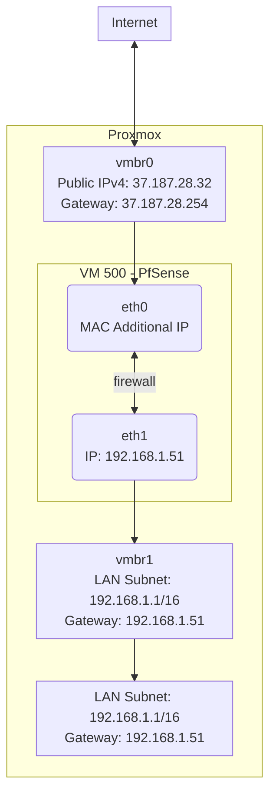
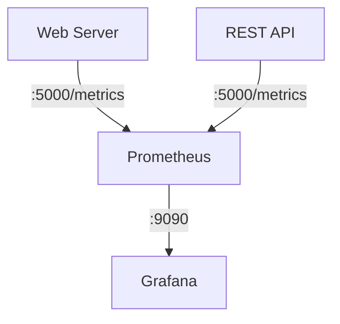
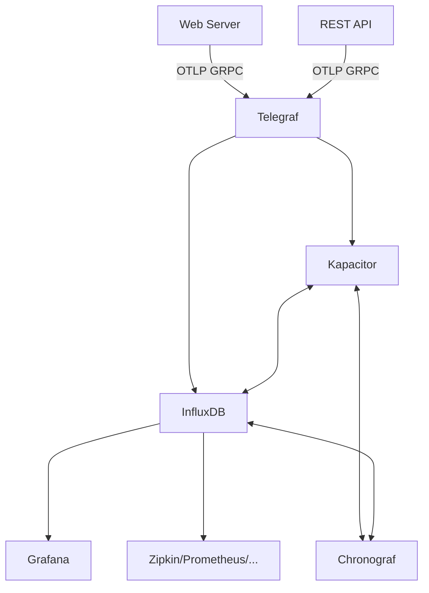
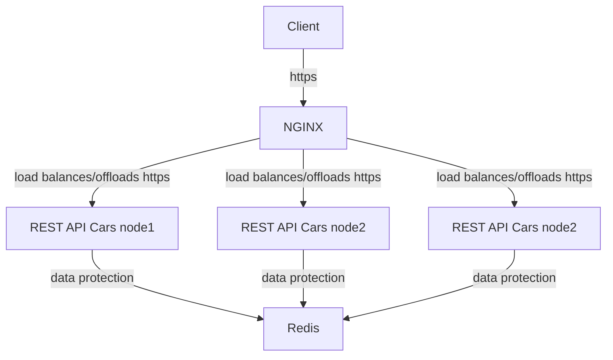

# Introduction

While developing it may be useful to have a setup which mirrors your final production setup as close as possible. In practice, hardware and/or time are not always available on time to setup a test or acception environment which mirrors production. Therefore, having a setup that you can easily (re-)deploy on a (local) virtual environment may be your way out.  

This project contains *Ansible* scripts to setup *Proxmox* and/or *Azure* VMs/containers to install a web site on prem or in the cloud to ease/speed-up development. The *Ansible* scripts in this project assume that you need servers to host the following roles:

* Web Server
* Cache
* Database
* Identity Server  
* REST API endpoints
* Prometheus monitoring
* Grafana dashboards

## Contents

- [Introduction](#introduction)
  - [Contents](#contents)
  - [Prerequisites](#prerequisites)
    - [Proxmox prerequisites](#proxmox-prerequisites)
      - [Hyper-V install](#hyper-v-install)
      - [Bare metal install](#bare-metal-install)
      - [Promox API user](#promox-api-user)
    - [Azure prerequisites](#azure-prerequisites)
    - [Ansible prerequisites](#ansible-prerequisites)
    - [Secrets prerequisites](#secrets-prerequisites)
  - [Proxmox](#proxmox)
    - [Proxmox VM setup](#proxmox-vm-setup)
    - [Proxmox hosts file](#proxmox-hosts-file)
    - [Uploading Proxmox VM(s) templates](#uploading-proxmox-vms-templates)
    - [Installing Proxmox VM(s)](#installing-proxmox-vms)
    - [Proxmox public IP](#proxmox-public-ip)
    - [Addding Proxmox VM(s) to known\_hosts](#addding-proxmox-vms-to-known_hosts)
    - [Stopping Proxmox VM(s)](#stopping-proxmox-vms)
    - [Starting Proxmox VM(s)](#starting-proxmox-vms)
    - [Removing Proxmox VM(s)](#removing-proxmox-vms)
    - [Proxmox Firewall Preparation](#proxmox-firewall-preparation)
    - [Bridges](#bridges)
    - [SSH into the Proxmox VM](#ssh-into-the-proxmox-vm)
  - [Azure](#azure)
  - [REDIS](#redis)
    - [Install REDIS](#install-redis)
  - [Authentication Server](#authentication-server)
    - [Install Authentication Server](#install-authentication-server)
  - [REST API](#rest-api)
    - [Install REST API](#install-rest-api)
  - [Database](#database)
    - [Install SQL Server](#install-sql-server)
  - [Web server](#web-server)
    - [Install the Blazor Application](#install-the-blazor-application)
  - [Application Performance Monitoring](#application-performance-monitoring)
    - [Prometheus server](#prometheus-server)
      - [Install Prometheus server](#install-prometheus-server)
    - [Collector](#collector)
      - [Install InfluxDB](#install-influxdb)
    - [Grafana server](#grafana-server)
      - [Install Grafana server](#install-grafana-server)
  - [Proxy](#proxy)
    - [NGINX](#nginx)
      - [Log format](#log-format)
      - [Load balancing](#load-balancing)
      - [HTTPS configuration](#https-configuration)
      - [Access logging](#access-logging)
      - [Location block and proxy settings](#location-block-and-proxy-settings)
      - [Optional websocket support](#optional-websocket-support)
  - [REDIS](#redis-1)
  - [References](#references)
  - [TODO](#todo)

## Prerequisites

### Proxmox prerequisites

If you'd like to deploy on Proxmox, first install Proxmox on a host. Your host is a bare metal machine or a virtual machine with nesting enabled. [Qemu](https://www.qemu.org/) For instance, allows to nest VMs. **TBC**  

Depending on your particular installation and/or test requirements, it may be relevant to configure an *DNS* server during the *Proxmox* installation: this will ensure that the machine running *Proxmox* (bare metal or VM) and the VMs running on *Proxmox* all are in the same subnet.

In this document/config it is assumed that you will use the following domain(s):

```text
# the ip address of the machine that (will) run(s) your web site, for example the ip address of proxmox vm 100
192.168.1.60 cars.be
```

Add the entries above in the hosts file on

* the machine running the Ansible installation scripts
* the clients you use to visit the web site

If all has gone well, you should have (after running the *Ansible* scripts) a setup like:


#### Hyper-V install

You can install Proxmox on Windows Hyper-V. Create the virtual machine with the standard procedure and execute the following command in Powershell

```Powershell
Set-VMProcessor -VMName <Name of your Proxmox VM> -ExposeVirtualizationExtensions $true
``` 

to switch on Hyper-V's nested virtualization. Download and mount the Proxmox ISO, after booting, click in the VM screen and tap on Enter to start the install. If your install hangs at `Trying to detect country`, disable your internet connection and restart the installer.  

After installing Proxmox on Hyper-V, you will notice that calling an endpoint on your Hyper-V VM from WSL2 doesn't work. Open the Hyper-V Manager and next the Virtual Switch Manager


and not the two different virtual switches. As documented [on](https://techcommunity.microsoft.com/t5/itops-talk-blog/windows-subsystem-for-linux-2-addressing-traffic-routing-issues/ba-p/1764074) we need to enable forwarding across both virtual switches:

```Powershell
Get-NetIPInterface | where {$_.InterfaceAlias -eq 'vEthernet (Default Switch)' -or $_.InterfaceAlias -eq 'vEthernet (WSL (Hyper-V firewall))'} | Set-NetIPInterface -Forwarding Enabled
```

:fire: Note the **vEthernet(...)** in the IP interface aliases, if you are not sure about the aliases, first run

```Powershell
Get-NetIPInterface
```

and check the second column.  

#### Bare metal install

Follow the default installation procedure [on](https://www.proxmox.com/en/proxmox-virtual-environment/get-started).

#### Promox API user

Before using the Ansible scripts, you will need a Proxmox API user:

* Log into the Proxmox Web UI
* Select datacenter from the left menu
* Select users from the left sub-menu
* We will use the default root@pam user
* Select API tokens from the left sub-menu
* Click add
  * User: root@pam
  * Token ID: input a random string, for [example](https://www.random.org/passwords/?num=1&len=24&format=plain&rnd=new) and record the token ID
  * record the token secret

After adding the user and API token, select Datacenter and click on Permissions and Add API Token Permission. Choose

* Path: /
* API Token: root@pam<tokenID>
* Role: Administrator
* Propagate: select

### Azure prerequisites

TODO

### Ansible prerequisites

As we are using [Ansible](https://www.ansible.com/) to automate our install and deploy, you will have to meet the following minimum requirements on the hosts which will run the *Ansible* scripts: [Ansible minimum requirements](https://docs.ansible.com/ansible/latest/collections/community/general/proxmox_module.html).

For this project, we will need some extra dependencies. Install the following *Ansible* role(s):

```bash
ansible-galaxy install geerlingguy.redis
```

:fire: Microsoft has an ansible SQL Server role which supports RHEL, as we use Ubuntu for now, the Microsoft Ansible SQL Server role is not usable.

or write all dependencies to a `requirements.yml` file

```yaml
---
roles:
  - name: geerlingguy.redis
    type: galaxy
    source: https://galaxy.ansible.com

collections:
  # With just the collection name
  - my_namespace.my_collection    
```

and install with:

```bash
ansible-galaxy role install -r requirements.yml #what we use
ansible-galaxy collection install -r requirements.yml
```

Add additional Python dependencies with:

```bash
pip install proxmoxer
```

### Secrets prerequisites

Secrets are stored in env variables in files

* .env
* .env.prod
* .env.acc
* .env.dev

Keep your *PROD*, *ACC* and *DEV* secrets in the corresponding files and copy to `.env` before you start the ansible scripts. `source` .env Before executing your first Ansible script.

:fire: Obviously, none of the `env` files belongs in your repo.

Your `env` file should at least contain your public key to connect with ssh to the VMs:

```bash
#!/bin/bash
export SSH_PUB_KEY="ssh-rsa AAAAB.... your_name@your_machine"
```

If you are unsure about your public key, check `~/.ssh/id_rsa_pub`.

## Proxmox

### Proxmox VM setup

As far as I know, *Ansible* is not the tool of choice to setup *VM*s on cloud/datacenter solutions like *Azure*, *Proxmox*, etc. Nevertheless, as an excercise, I've chosen to setup my *Azure* and *Proxmox* *VM*s with *Ansible*.  

*Ansible* Uses an `inventory` to define the machines (*ip addresses*) and machine roles to install/setup your software infrastructure. As we start with a clean install (no existing *VM*s), it is rather difficult to define an `inventory`.  

Therefore, we start with a play `proxmox.cars.be` which has a [vars file](./playbooks/proxmox.cars.be/vars/main.yml) defining the *inventory*, for example:

```yml
proxmox_vms:
 - ip: 192.168.1.60
   id: 600
   group:
    - "webserver"
 - ip: 192.168.1.61
   id: 601
   group:
    - "redis"
 - ip: 192.168.1.62
   id: 602
   group:
    - "database"
```

On the other hand, it is probably wise to structure/group *ip addresses* and *vm id*s under `group:` which is more aligned with an *Ansible inventory* (and easier to maintain). :fire: That's for another version.  

After running the [proxmox.cars.be](./playbooks/proxmox.cars.be/) play, we can use the initialized *VM*s as defined in the [vars file](./playbooks/proxmox.cars.be/vars/main.yml) as the basis for the *Ansible* `ìnventory`.  

Running the [proxmox.cars.be](./playbooks/proxmox.cars.be/) play is detailed in [Uploading templates](###uploading-proxmox-vm(s)-templates) and [Installing VMs on Proxmox](###installing-proxmox-vm(s)).  

The [hosts](./playbooks/hosts) file contains the `inventory` for the other *Ansible* plays. :fire: At this moment, the [hosts](./playbooks/hosts) file is not generated from the [proxmox.cars.be](./playbooks/proxmox.cars.be/) play, it is probably a good idea to change that in future versions.  

### Proxmox hosts file

You can pass a hosts file to the `ansible-playbook` command with:

```bash
-i ./hosts
```

### Uploading Proxmox VM(s) templates

```bash
ansible-playbook proxmox_ubuntu_vm-setup.yml -K --tags=vm_upload -vvv
```

:fire: If this tag fails, you may have to upgrade your community.general modules, see [issue](https://github.com/ansible-collections/community.general/issues/6974):

```bash
ansible-galaxy collection install community.general
```

you should have at least version 7.2.1

```bash
ansible-galaxy collection list
```

and look for community.general.

:fire: You probably have two installs of community.general, if you'd like to run the system-wide install:

```bash
sudo ansible-galaxy collection install community.general
```

### Installing Proxmox VM(s)

```bash
ansible-playbook proxmox_ubuntu_vm-setup.yml -K --tags=vm_init -vvv
```

### Proxmox public IP

Ubuntu 20.04 network config: https://www.serverlab.ca/tutorials/linux/administration-linux/how-to-configure-networking-in-ubuntu-20-04-with-netplan/

config vm proxmox: https://help.ovhcloud.com/csm?id=kb_article_view&sysparm_article=

fwd ssh https://unix.stackexchange.com/questions/421521/proxy-ssh-through-nginx as an alternative for a firewall/vpn

```nginx
stream {

        upstream ssh {
                server 10.0.0.17:22;
        }

        server {
                listen 8022;
                server_name gitlab.web.com;
                proxy_pass ssh;
        }

}
```

### Addding Proxmox VM(s) to known_hosts

If you removed existing VMs/Containers or are building new VMs/Containers, you should remove the old entries in `known_hosts` and add new entries:

```bash
ANSIBLE_HOST_KEY_CHECKING=false ansible-playbook knowhosts-setup.yml -i hosts -K -vvv
```

When you observe an additional line being added to your known_hosts file after connecting to a server via SSH, even after manually adding the server's fingerprint with ssh-keyscan or with `ansible-playbook knowhosts-setup.yml`, it typically relates to how SSH handles and verifies the identity of the servers it connects to. Here are a few reasons why this might happen:

1. Different Key Types  
If you initially add the server's `ED25519` key fingerprint to your known_hosts using ssh-keyscan -H -t ed25519 ip_address, but the server is also configured to use another type of SSH key (e.g., RSA, ECDSA), the SSH client might add the fingerprint of this additional key to the known_hosts file upon the first connection. This occurs because your initial scan and add operation only included the ED25519 key, and upon connection, SSH automatically adds any other keys presented by the server that weren't already in known_hosts.

2. Hostname and IP Address Entries  
Another common reason is the difference in how you reference the server in your ssh command versus what was initially scanned. For instance, if you scanned the IP address and then used the hostname (or vice versa) to connect, SSH treats these as separate entries. SSH distinguishes between IP addresses and hostnames because they can technically present different keys (consider virtual hosts or shared IP scenarios). As a result, SSH might add a new line for the same server under its different identifier (IP or hostname).

3. SSH Configuration and Aliases  
Your SSH client's configuration might influence how known_hosts is managed. For example, if you use an SSH config file (~/.ssh/config) with aliases or specific host entries that define hostname patterns or specific key types, your SSH client might treat connections that match different patterns as distinct, even if they ultimately resolve to the same server.

4. Port Forwarding or Jump Hosts  
If your connection involves port forwarding or using a jump host (also known as a bastion host), the SSH client may add entries for these intermediate steps. This is more likely in complex networking setups where direct connections to the target server are not possible without going through intermediary servers.

Troubleshooting Tips:

* Review the known_hosts file: Compare the entries before and after the connection. Look for differences in the key types, hostnames/IP addresses, or additional details that might explain the new entry.
* Use verbose mode with SSH: Connecting with `ssh -v root@ip_address` can provide detailed logs that explain what keys are being checked, offered, and added to known_hosts. This might give you a clearer picture of why the additional line is added.
* Check SSH client configuration: Review your SSH client's configuration file (if you have one) for any settings that might affect how known_hosts entries are managed or how connections are established.

Understanding the exact reason requires examining the specifics of your SSH setup, the server configuration, and the entries in known_hosts.

For our particular setup, we can edit the server config `sshd_config` file on the server we connect to to enforce the usage of `ED25519` keys:

```ini
#HostKey /etc/ssh/ssh_host_rsa_key
#HostKey /etc/ssh/ssh_host_ecdsa_key
HostKey /etc/ssh/ssh_host_ed25519_key
KexAlgorithms curve25519-sha256,curve25519-sha256@libssh.org
PubkeyAcceptedKeyTypes ssh-ed25519
```

in addition, make sure that folder `/run/sshd` exists on the server:

```bash
mkdir /run/sshd
chmod 0755 /run/sshd
systemctl restart sshd
```

Clients, however, should now support `ED25519`, i.e. use:

```bash
ssh-keygen -t ed25519 -C you@cars.be
```

If you now connect with:

```bash
ssh -v root@192.168.1.68
```

you will notice in the output that ssh will attempt different keys, for example:

```text
debug1: Will attempt key: /home/you/.ssh/id_rsa RSA SHA256:....
debug1: Will attempt key: /home/you/.ssh/id_ecdsa
debug1: Will attempt key: /home/you/.ssh/id_ecdsa_sk
debug1: Will attempt key: /home/you/.ssh/id_ed25519 ED25519 SHA256:....
debug1: Will attempt key: /home/you/.ssh/id_ed25519_sk
debug1: Will attempt key: /home/you/.ssh/id_xmss
debug1: Will attempt key: /home/you/.ssh/id_dsa
```

To conclude, the server decides about the security of the keys used by the client, therefore, we will configure all sshd daemons for `ED25519`:  

```bash
ansible-playbook sshdserver_setup.yml -i hosts --user root -K -vvv
```

:fire: User root is specified with `--user root`: the hosts we connect to have the `ED25519` key under `/root/.ssh/authorized_keys`, so we have to connect as `root` to use this key.  

### Stopping Proxmox VM(s)

```bash
ansible-playbook proxmox_ubuntu_vm-setup.yml -K --tags=vm_stop -vvv
```

### Starting Proxmox VM(s)

```bash
ansible-playbook proxmox_ubuntu_vm-setup.yml -K --tags=vm_start -vvv
```

if necessary, you can restart with

```bash
ansible-playbook proxmox_ubuntu_vm-setup.yml -K --tags=vm_restart -vvv
```

### Removing Proxmox VM(s)

Before removing a Proxmox VM, first stop the Proxmox VM, so execute the [stopping proxmox](#stopping-proxmox-vms) command or add tag vm_stop before the *vm_remove* tag in the following command:

```bash
ansible-playbook proxmox_ubuntu_vm-setup.yml -K --tags=vm_stop,vm_remove -vvv
```

### Proxmox Firewall Preparation

Before you can install a firewall, you have to make sure that at least one of your VMs an access the Internet, all
other VMs on Proxmox have to be able to communicate with each other in a LAN only. No Internet connectivity is required for
the "non firewall" VMs.  

In order to arrange this setup, we will need two bridges:

* one bridge which will *bridge* the incoming Internet traffic to the firewall and vice-versa
* one bridge which will allow the VMs to communicate within a LAN
* the VMs within the LAN use the LAN IP address of the firewall as gateway to return traffic over the firewall/VPN

A step-by-step guide to achieve this:

* You should have one existing bridge with a IPv4 which equals your public IP address (not the additional IP address)
* edit the MAC address of the network interface of the VM which has to access the Internet, enter the MAC address of the additional IP address
* Create a New Bridge for the Internal Network
  * Log into Proxmox VE Web Interface: Open your browser and access the Proxmox VE web interface by navigating to your Proxmox server's IP address.  
  * Navigate to 'System' -> 'Network': Here you will see your current network configuration, including any bridges and physical interfaces.
  * Create a New Bridge:
    * Click on "Create" and select "Linux Bridge".
    * Give the bridge a meaningful name, like vmbr1 (assuming vmbr0 is your existing bridge for the internet connection).
    * Assign it an IP address that fits within your internal network scheme (e.g., 192.168.1.1/16). If the Proxmox host doesn't need to communicate on this network, you may leave the IP address field empty.
    * Leave the Gateway field empty (the existing bridge has a Gateway)
    * Ensure the "Autostart" option is checked.
    * Leave the "Bridge ports" field empty if this bridge is for internal VM communication only.
    * Click "Create".
* Attach a Second Network Interface to Your VM
  * Select Your VM: In the Proxmox web interface, go to the "Server View", find the VM you want to configure, and click on it.
  * Add Network Device:
    * With the VM selected, go to the "Hardware" tab.
    * Click "Add" and choose "Network Device".
    * For "Model", you can choose "VirtIO (paravirtualized)" for better performance or "e1000" for broader compatibility.
    * Under "Bridge", select the new bridge you created (vmbr1).
    * Click "Add".
* Configure the Operating System Inside the VM: After attaching the second network interface, you need to configure the operating system inside the VM to use this new interface.  
  * Access Your VM: Log into your VM via the Proxmox console or SSH.
  * Identify the New Interface: Run ip a or ifconfig to list your network interfaces. You should see a new one (likely named eth1 or similar).
  * Configure the Network Interface: You'll need to edit the network configuration file or use a network manager to configure the interface. The exact steps vary depending on your Linux distribution, for Ubuntu:

  ```network
  # /etc/network/interfaces - create the file if it does not exist
  auto eth1
  iface eth1 inet static
      address 192.168.1.x
      netmask 255.255.0.0
      gateway 192.168.1.1
  ```

  For pfSense, you don't need to edit /etc/network/interfaces or /etc/netplan/..., it is sufficient to add the second network interface and assign its IP address in the pfSense UI.
* Restart the Network Service or the VM to apply changes.  

### Bridges

The terms *bridge* and *switch* are often used interchangeably in the context of networking, but they refer to devices that operate at the data link layer (Layer 2) of the OSI model.  

A bridge in Proxmox (or any other virtualization platform) is conceptually closer to a physical switch than to a traditional physical bridge in terms of its functionality and use case. Here's why:

* Virtual Bridges and Physical Switches: Similarities

  * Multiple Connections: Both virtual bridges in Proxmox and physical switches are designed to connect multiple devices (or virtual machines/containers in the case of Proxmox) within a network. They allow for the creation of network segments that can communicate internally and externally.
  * Traffic Management: Like a physical switch, a virtual bridge can manage and forward traffic between its connected interfaces based on MAC addresses, efficiently directing packets to their intended destinations within the virtual network or to external networks. 
  * Advanced Networking Features: While not as feature-rich as some high-end physical switches, virtual bridges in Proxmox can still offer several advanced networking features, such as VLAN tagging, which is a hallmark of switch capabilities.

* Differences from Physical Bridges

  * Functionality: Traditional physical bridges were primarily used to connect two network segments, with a focus on reducing collision domains and managing traffic between these segments. While a Proxmox bridge can perform a similar role in a virtual environment, it more closely mirrors the multiport, multipurpose functionality of switches by allowing numerous virtual machines and containers to connect to various networks.
  * Port Density: Physical bridges typically have a very limited number of ports (often just two), akin to the simplest form of segmentation. In contrast, a virtual bridge in Proxmox can handle connections from numerous VMs and containers simultaneously, much like a physical switch with many ports.

* Use in Virtualization

  * Network Virtualization: Virtual bridges play a crucial role in network virtualization, providing a platform for VMs and containers to communicate as if they were connected to a physical switch. This is essential for creating complex virtual network topologies that resemble physical network infrastructures.
  * Flexibility and Scalability: In virtual environments, bridges offer a level of flexibility and scalability that is more characteristic of switches. Administrators can dynamically adjust network configurations, add or remove VMs from networks, and implement security policies or VLANs without needing physical hardware changes.

In summary, while the terminology may suggest a direct analogy to physical bridges, in practice, the role of a bridge in Proxmox and other virtualized environments aligns more closely with the functionalities of a physical switch, especially concerning its ability to connect multiple devices and manage network traffic efficiently within a virtualized networking context.

For our setup, that becomes:



~~### Firewall~~

This task will specifically focus on installing and configuring WireGuard, a popular, modern, and secure VPN software, on a Linux VM. WireGuard is chosen for its simplicity and ease of configuration compared to traditional VPN software.

```bash
ansible-playbook firewallserver-setup.yml -i hosts -K -vvv
```

Download the wireguard client [from](https://www.wireguard.com/install/). 

### SSH into the Proxmox VM

```bash
ssh root@192.168.1.60 -i /home/user/.ssh/authorized_keys
```

## Azure

TODO

## REDIS

### Install REDIS

```bash
ansible-playbook redis-setup.yml -i hosts -K -vvv
```

:fire: Note the `hosts` file, at the moment, only ip address are used in the host file. In an ideal case, hostnames as setup on *Proxmox* should be used grouped by labels redis, webserver, etc.

:fire: If you get an error like

```bash
 "msg": "Unable to start service redis-server: Job for redis-server.service failed because the control process exited with error code.\nSee \"systemctl status redis-server.service\" and \"journalctl -xe\" for details.\n"
```

after running the redis playbook, you probably forgot to `source .env`.  

## Authentication Server

### Install Authentication Server

`ABP` supports [IdentityServer4](https://github.com/IdentityServer/IdentityServer4) and [OpenIddict](https://github.com/openiddict/openiddict-core). As the `ABP` startup templates support *OpenIddict* since *ABP v6.0.0* we will only support `OpenIddict`.  

```bash
ansible-playbook identityserver-setup.yml -i hosts -K -vvv
```

After installing the authentication server, you can request a client credentials (server to server), check the documentation and example [in the cars.be repo](https://github.com/bartengine27/cars.be/tree/abp_8).

## REST API

### Install REST API

```bash
ansible-playbook httpapiserver-setup.yml -i hosts -K -vvv
```

The *REST API* contains a custom metric and controller, open the *REST API* interface (`Swagger`) and call `/api/car/increment` to increment the custom metric. If you'd like to monitor this metric in real-time, *SSH* into the [HTTP server](./playbooks/hosts) and run:  

```bash
#if nessary, install dotnet-counters
#dotnet tool install --global dotnet-counters
dotnet-counters monitor --name Be.Cars.HttpApi.Host --counters Be.Cars.Metrics.CustomMetrics
```

## Database

### Install SQL Server

```bash
ansible-playbook database-setup.yml -i hosts -K -vvv
```

After installing your DB server, you can SSH into the machine and open an SQL shell with (assuming you use password `p@55w0rD`):

```bash
sqlcmd -S 127.0.0.1 -U sa -P p@55w0rD -C
```

## Web server

### Install the Blazor Application

For this project, we will host the application (Blazor application) on [Kestrel](https://learn.microsoft.com/en-us/aspnet/core/fundamentals/servers/kestrel?view=aspnetcore-7.0). `Kestrel` is automatically included by publishing the application.

```bash
ansible-playbook webserver-setup.yml -i hosts -K -vvv
```

:fire: Install the web server after installing the database: while installing the web server, the DB migration project will run and initialize the database.  

## Application Performance Monitoring

In this project we will use [Prometheus](https://prometheus.io/) as it supports [OTLP (Open Telemetry Protocol)](https://opentelemetry.io/) which is used in the example code (web site and REST API). You can also export OTel (Open Telemetry) data to [Jaeger](https://www.jaegertracing.io/) or [Zipkin](https://zipkin.io/). For an overview, please check the following list of  [APM (Application Performance Monitoring) vendors](https://opentelemetry.io/ecosystem/vendors/).



:fire: The example code is written in dotnet core, which has its own instrumentation APIs for logging, metrics and tracing. Therefore, OTel collects telemetry from the build in dotnet core APIs. The benefit that OTel brings as an industry standard is a common mechanism for collecting telemetry data and integrating APMs. For more information [see](https://learn.microsoft.com/en-us/dotnet/core/diagnostics/observability-with-otel).

:fire: If you are using a different programming language, please check the [supported programming languages](https://opentelemetry.io/docs/languages/).  

### Prometheus server

As illustrated in the figure above, Prometheus is configured with the metrics endpoints of the Web Server and REST API. Extend this configuration if you'd like to inlude other systems/microservices/etc.

#### Install Prometheus server

```bash
ansible-playbook prometheusserver-setup.yml -i hosts -K -vvv
```

### Collector

For a more flexible setup, you may be interested in the setup of an *Otel* collector. For example `InfluxDB` with [Telegraf](https://www.influxdata.com/time-series-platform/telegraf/) and the [OpenTelemetry Input Plugin](https://github.com/influxdata/telegraf/blob/release-1.21/plugins/inputs/opentelemetry/README.md):



For completeness, the diagram above mentions [Chronograf](https://www.influxdata.com/time-series-platform/chronograf/) the user interface and administrative comonent of *InfluxDB* which allows to interact with the [TICK-stack](https://www.influxdata.com/time-series-platform/) and [Zipkin](https://zipkin.io/) a distributed tracing system.  

You can also use the [OpenTelemetry Collector](https://opentelemetry.io/docs/collector/).  

#### Install InfluxDB

```bash
ansible-playbook collectorserver-setup.yml -i hosts -K -vvv
```

After installing, open the UI on `http://{{ groups['otlp_controller'][0] }}:8086)`.

### Grafana server

#### Install Grafana server

```bash
ansible-playbook grafanaserver-setup.yml -i hosts -K -vvv
```

After installing *Grafana*, you can browse to the *Grafana* endpoint (check the *Grafana* endpoint in [hosts](./playbooks/hosts)) and open the `ASP .NET Core` dashboard: 


## Proxy

### NGINX

The provided NGINX configuration demonstrates a setup designed to facilitate secure HTTPS connections to a load-balanced backend comprised of multiple HTTPS API servers:



The `NGINX` configuration for this setup illustrates a robust setup for managing secure, load-balanced connections to a backend API cluster, with a focus on detailed logging, security with SSL, and flexibility to support large headers and optional WebSocket connections:  

```nginx
http {
    log_format upstreamlog '[$time_local] $remote_addr - $remote_user - $server_name $host to: $upstream_addr: $request $status upstream_response_time $upstream_response_time msec $msec request_time $request_time';

    upstream https_api {
        server 192.168.1.64:5000;
        server 192.168.1.68:5000;
        server 192.168.1.69:5000;
    }

    server {
        listen 443 ssl;
        listen [::]:443 ssl;
        include snippets/self-signed.conf;
        include snippets/ssl-params.conf;

        client_header_buffer_size 4k;
        large_client_header_buffers 4 8k; # Increase if JWT or other headers are large      

        access_log /var/log/nginx/access.log upstreamlog;

        location / {
            proxy_pass https://https_api;
        }

        # Header adjustments for proxying
        proxy_set_header Host $host;
        proxy_set_header X-Real-IP $remote_addr;
        proxy_set_header X-Forwarded-For $proxy_add_x_forwarded_for;
        proxy_set_header X-Forwarded-Proto $scheme;
        proxy_set_header Authorization $http_authorization;
            
        # Other possible headers you might want to set
        # proxy_set_header Authorization ""; # If you need to reset the Authorization header

        # WebSocket support (if needed)
        # proxy_http_version 1.1;
        # proxy_set_header Upgrade $http_upgrade;
        # proxy_set_header Connection "upgrade";
    }
}
```

#### Log format

To capture detailed information about requests and responses, we define a custom logging format: the `log_format` directive specifies a custom format named `upstreamlog`, which includes *timestamps, client IP, the requested server name and host, the upstream server address that handled the request, the request details, status code, response times, and request processing times*. This detailed logging is crucial for debugging and monitoring the performance of the upstream servers, in particular inspecting load balancing as the log will display the IP address of the upstream REST API node.

#### Load balancing

Distribute incoming traffic across multiple backend servers: the upstream block named `http_api` defines a cluster of servers (with specified IP addresses and port numbers) that requests will be load balanced across. This setup increases the application's scalability and reliability by distributing the load and providing redundancy.

#### HTTPS configuration

We configure NGINX to serve HTTPS traffic and to use specific SSL parameters and certificates.

* The **listen 443 ssl directives** instruct NGINX to listen for incoming connections on port 443 with SSL encryption, including IPv6 connections ([::]:443 ssl).
* The **include directives** incorporate additional SSL configurations and self-signed certificate details from external files (self-signed.conf and ssl-params.conf), modularizing the SSL setup for easier management.
* client_header_buffer_size And large_client_header_buffers directives adjust the buffer sizes for client request headers, accommodating potentially large JWT tokens or other large headers.

Note the HTTPS offloading and re-encryption in the configuration above which involves the NGINX server acting as a termination point for incoming HTTPS connections from clients. NGINX decrypts these connections, inspects the traffic, and then re-encrypts the traffic before forwarding it to the backend servers over HTTPS using separate, internal SSL certificates. This process allows for secure communication both externally with clients and internally within the data center:

* **Decryption of Incoming HTTPS Requests**: NGINX uses public-facing SSL certificates to decrypt data received over SSL/TLS from clients. This is the offloading part.
* **Inspection and Processing**: Once decrypted, NGINX can inspect, log, or manipulate the HTTP content as necessary. This step can involve modifying headers, applying access controls, or making routing decisions.
* **Re-Encryption and Forwarding**: NGINX then re-encrypts the requests using internal SSL certificates and forwards them to the backend servers over HTTPS. This ensures that traffic remains secure as it traverses the internal network.
* **Secure Internal Communication**: The backend servers, configured with the internal certificates, decrypt the re-encrypted requests, process them, and send back the responses. NGINX then encrypts the responses again (if necessary) before sending them back to the clients.

HTTPS offloading and re-encryption has the following benefits:

* **Enhanced Security Across the Board**: This setup ensures end-to-end encryption of data, maintaining security from the client to the NGINX server and from the NGINX server to the backend servers. Using internal certificates for the data center adds an extra layer of security within the internal network.
* **Centralized Public SSL Management**: Public-facing SSL certificate management remains centralized at the NGINX server, simplifying the administration of public encryption keys and certificates.
* **Flexible Trust and Security Policies**: The separation of external and internal certificates allows for distinct trust domains and security policies. For example, stronger or different encryption standards can be applied internally compared to what is used for public internet traffic.
* **Inspection and Added Controls**: Decrypting the traffic at the NGINX layer allows for detailed inspection and the application of additional security controls before re-encrypting and sending it to backend services. This can be crucial for compliance with security policies, logging, or performing deep packet inspection for threat detection.
* **Performance and Scalability**: While the NGINX server handles the computational overhead of encrypting and decrypting traffic twice, it offloads backend servers from doing so. This can be optimized by using hardware that accelerates SSL processing. Furthermore, it allows backend servers to be scaled out without the need to manage public SSL certificates on each of them.
* **Secure Internal Traffic**: Using HTTPS internally protects against potential threats lurking within the data center, ensuring that sensitive data is encrypted in transit even within the network's trusted boundaries.

In summary, employing HTTPS offloading and re-encryption with NGINX provides robust security by ensuring encrypted traffic both externally and internally while centralizing certificate management and offering the ability to inspect and manipulate HTTP traffic. This configuration enhances the overall security posture and flexibility of managing traffic flows within distributed application architectures.

#### Access logging

In orde to use a custom-defined log file path and format, the `access_log` directive specifies the path to the access log file and instructs NGINX to use the *upstreamlog* format (`log_format upstreamlog '[$ti...`) for logging, ensuring that detailed information about each request and its handling is logged for future analysis.

#### Location block and proxy settings

Request routing and proxying behavior for the root path is defined with:

  * The **location / block** matches all requests and uses the proxy_pass directive to forward them to the http_api upstream cluster, enabling load balancing.
  * The **proxy_set_header directives** modify request headers to include the original host, the real client IP address, and the protocol used, ensuring that the proxied requests contain necessary information for backend services to process them correctly.
  * The configuration optionally supports **forwarding the Authorization header**, preserving JWT or other authentication tokens needed by the backend services.

#### Optional websocket support

This part of the configuration provides the necessary headers to support WebSocket connections if needed:

* The commented-out directives (`proxy_http_version`, `proxy_set_header Upgrade`, and `proxy_set_header Connection`) are set up to enable WebSocket support, ensuring that NGINX can proxy WebSocket connections correctly. These lines can be uncommented and adjusted as needed based on the application's requirements.

## REDIS

Cross-Site Request Forgery (CSRF) is a security threat where an attacker tricks a user into executing unwanted actions on a web application in which they're authenticated. If the victim is a regular user, a successful CSRF attack can force them to perform state-changing requests like transferring funds, changing their email address, and so forth. If the victim has an administrative account, CSRF can compromise the entire web application. CSRF exploits the trust that a site has in the user's browser, and unlike Cross-Site Scripting (XSS), which exploits the trust a user has in a particular site, CSRF exploits the trust that a site has in the user's browser.

In a distributed web application architecture, particularly one that scales horizontally as in this setup, requests from the same user can be routed to different servers across multiple requests due to load balancing. This poses a challenge for CSRF protection mechanisms that rely on keeping track of state, such as synchronizer tokens or double submit cookies, because the server handling a subsequent request might not have access to the tokens generated by another server on a previous request.

REDIS, as a fast, in-memory data store offers a solution for storing CSRF protection keys in such a distributed setup. 

In the drawing above, REDIS was added explicitely to stress not necessarily obvious impact of the distributed nature and horizontal scalability of the setup, i.e. its non-trivial impact on CSRF. More details are available [on the cars.be repo](https://github.com/bartengine27/cars.be/tree/abp_8).

## References

* [Playbooks directory](https://charlesreid1.com/wiki/Ansible/Directory_Layout/Details)

## TODO

* ssh-keygen: add fingerprints automatically
* all passwords to env variables
* Azure
* align the [vars](./playbooks/proxmox.cars.be/vars/main.yml) file with an *Ansible* `inventory`
* generate the *Ansible* `inventory` file or use an `inventory` file as a *vars.yml* file to setup *VM*s (if possible)
* install the webserver usually fails first
* integrate [prometheus alerts](https://github.com/prometheus/alertmanager) or [grafana alerts](https://grafana.com/docs/grafana/latest/alerting/fundamentals/alertmanager/) or ...
* install Collector endpoint
* custom dashboard displaying the custom metric
* [ssh fingerprint checks](https://stackoverflow.com/questions/32297456/how-to-ignore-ansible-ssh-authenticity-checking)
* setup nginx with ansible and a [self signed certifcate](https://www.digitalocean.com/community/tutorials/how-to-create-a-self-signed-ssl-certificate-for-nginx-in-ubuntu-20-04-1)
* [enable tcpdump in a container](https://cloud.garr.it/support/kb/general/enableTcpdumpInLXCContainer/)
https://netsplit.uk/posts/2022/10/19/remote_ovh_lab/