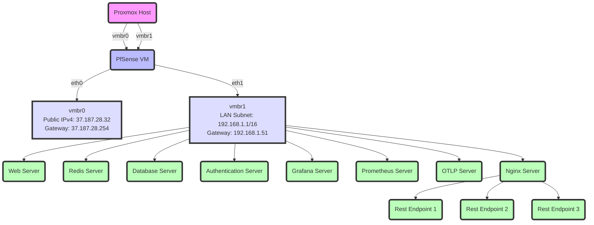
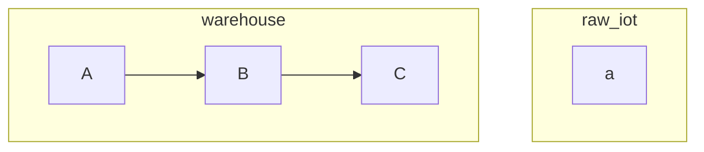
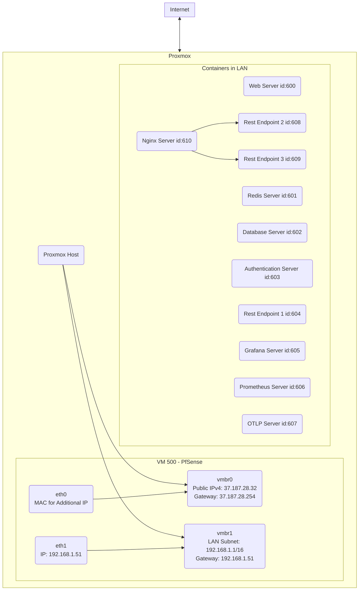

# Introduction

## OVH/Hetzner additional IP address

Using an additional IP address and MAC address for a Proxmox VM, instead of the public IP address of the server hosting Proxmox, is often necessary for several reasons related to network configuration, security, and functionality. Here are the key reasons why this approach is used:

* Network Isolation and Security

    Separation of Services: By assigning different IP addresses to different VMs, you can run services on the same ports on each VM without conflicts. This allows for better organization and reduces the risk of accidentally exposing services to the internet.
    Security Policies: Having separate IP addresses for each VM makes it easier to apply specific firewall and security policies to individual services or applications. This granularity in security management helps in minimizing the potential attack surface.

* Direct Internet Access

  * Avoiding NAT Complications: Using the host's public IP address typically requires network address translation (NAT) to allow VMs to share that single IP. NAT can complicate setups for certain applications, especially those requiring incoming connections, such as web servers or mail servers. Assigning a unique public IP to each VM simplifies the network configuration by eliminating the need for port forwarding and NAT rules.
  * Performance and Reliability: Directly assigning a public IP to a VM can offer better network performance and reliability for the services running on it, as the traffic does not need to be translated or routed through additional layers.

* Ease of Migration

    Flexibility: Having separate IP addresses for VMs makes it easier to migrate them between hosts or data centers with minimal downtime. The VM retains its IP address, ensuring that any DNS configurations or external connections remain intact without the need to update IP addresses in various configurations.

* MAC Address Binding

    Unique Network Identity: The MAC address is crucial for network communications at the data link layer. When using additional IP addresses from the provider, binding them to a virtual MAC address ensures that the traffic is correctly routed to and from the VM. This is particularly important in data center environments like OVH or Hetzner, where the network infrastructure relies on MAC addresses to enforce IP allocation and traffic filtering policies.

* Compliance with Provider Policies

    IP Allocation Policies: Many cloud and hosting providers, including OVH and Hetzner, have policies that require each public IP address to be associated with a unique MAC address for network management and security purposes. This helps in avoiding IP conflicts and ensuring that each customer's traffic is accurately segregated and routed within the provider's network infrastructure.

In summary, using additional IP and MAC addresses for Proxmox VMs provides better security, network configuration flexibility, direct access to the internet without NAT complications, and compliance with hosting provider policies. This approach offers significant advantages in managing virtualized environments, especially when hosting multiple services or applications that require internet connectivity.

## OVH additional IP address procedure

To allow a Proxmox VM to access the Internet using an additional IP address you've obtained from OVH, your process involves several steps, including the need to bind the additional IP to a virtual MAC address provided by OVH, and then configuring the Proxmox VM to use this virtual MAC address. Here's a detailed overview of how this process typically works:

* Request an Additional IP Address from OVH

    First, you have to request an additional IP address from OVH for your server. OVH typically allows you to request additional IPs through their control panel. 

* Configure the Proxmox VM with the Virtual MAC Address

  Once you have your additional IP and the associated virtual MAC address, you'll need to configure the VM within Proxmox to use this MAC address. Here’s how you can do that:

  * Access the Proxmox VE interface, and locate the VM you wish to configure.
  * Edit the VM's hardware settings, specifically the network adapter (NIC).
  * Set the MAC address of the VM's network adapter to the virtual MAC address provided by OVH. This ensures that the VM will be recognized on the network with the additional IP address you were assigned. In addition, change the IP and gateway address to the additional IP and gateway address. :fire: You don't have to change the IP address, it is advised to change it to avoid confusion.

* Configure the VM's Network Settings

    After setting the virtual MAC address in Proxmox, you'll need to configure the network settings within the VM itself. This involves setting the IP address, subnet mask, gateway, and DNS servers according to the details provided by OVH for your additional IP. The exact steps to do this can vary depending on the operating system of the VM.

    For Linux VMs, you'll typically edit network configuration files (like /etc/network/interfaces or use nmcli for NetworkManager-based systems).
    For Windows VMs, you'll go to Network and Sharing Center > Change adapter settings, right-click the network adapter, select Properties, and then configure the IP settings under Internet Protocol Version 4 (TCP/IPv4).

* Test the Configuration

    After completing these steps, ensure the VM can access the Internet by performing a simple test, such as pinging an external site (ping google.com) from within the VM. If there are connectivity issues, double-check the MAC address and network configuration settings.

