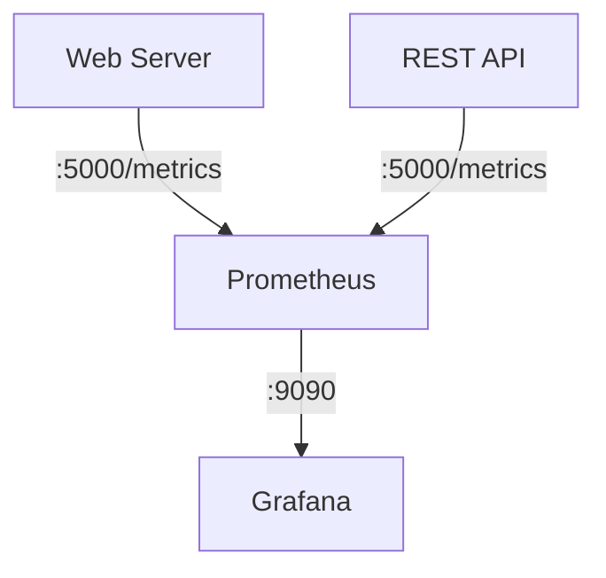
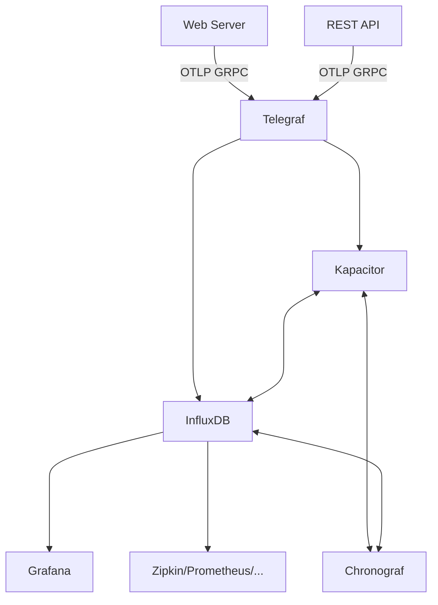

In this project we will use [Prometheus](https://prometheus.io/) as it supports [OTLP (Open Telemetry Protocol)](https://opentelemetry.io/) which is used in the example code (web site and REST API). You can also export OTel (Open Telemetry) data to [Jaeger](https://www.jaegertracing.io/) or [Zipkin](https://zipkin.io/). For an overview, please check the following list of  [APM (Application Performance Monitoring) vendors](https://opentelemetry.io/ecosystem/vendors/).



:fire: The example code is written in dotnet core, which has its own instrumentation APIs for logging, metrics and tracing. Therefore, OTel collects telemetry from the build in dotnet core APIs. The benefit that OTel brings as an industry standard is a common mechanism for collecting telemetry data and integrating APMs. For more information [see](https://learn.microsoft.com/en-us/dotnet/core/diagnostics/observability-with-otel).

:fire: If you are using a different programming language, please check the [supported programming languages](https://opentelemetry.io/docs/languages/).  

### Prometheus server

As illustrated in the figure above, Prometheus is configured with the metrics endpoints of the Web Server and REST API. Extend this configuration if you'd like to inlude other systems/microservices/etc.

#### Install Prometheus server

```shell
ansible-playbook prometheus.yml -i hosts -K -vvv
```

### Collector

For a more flexible setup, you may be interested in the setup of an *Otel* collector. For example `InfluxDB` with [Telegraf](https://www.influxdata.com/time-series-platform/telegraf/) and the [OpenTelemetry Input Plugin](https://github.com/influxdata/telegraf/blob/release-1.21/plugins/inputs/opentelemetry/README.md):



For completeness, the diagram above mentions [Chronograf](https://www.influxdata.com/time-series-platform/chronograf/) the user interface and administrative comonent of *InfluxDB* which allows to interact with the [TICK-stack](https://www.influxdata.com/time-series-platform/) and [Zipkin](https://zipkin.io/) a distributed tracing system.  

You can also use the [OpenTelemetry Collector](https://opentelemetry.io/docs/collector/).  

#### Install InfluxDB

```shell
ansible-playbook otelcollector.yml -i hosts -K -vvv
```

After installing, open the UI on `http://{{ groups['otlp_controller'][0] }}:8086)`.

### Grafana server

#### Install Grafana server

```shell
ansible-playbook grafana.yml -i hosts -K -vvv
```

After installing *Grafana*, you can browse to the *Grafana* endpoint (check the *Grafana* endpoint in [hosts](./../playbooks/hosts)) and open the `ASP .NET Core` dashboard: 


