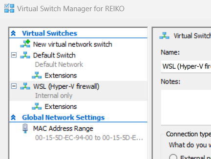

### Proxmox prerequisites

If you'd like to deploy on Proxmox, first install Proxmox on a host. Your host is a bare metal machine or a virtual machine with nesting enabled. [Qemu](https://www.qemu.org/) For instance, allows to nest VMs. **TBC**  

Depending on your particular installation and/or test requirements, it may be relevant to configure an *DNS* server during the *Proxmox* installation: this will ensure that the machine running *Proxmox* (bare metal or VM) and the VMs running on *Proxmox* all are in the same subnet.

In this document/config it is assumed that you will use the following domain(s):

```text
# the ip address of the machine that (will) run(s) your web site, for example the ip address of proxmox vm 100
192.168.1.60 cars.be
```

Add the entries above in the hosts file on

* the machine running the Ansible installation scripts
* the clients you use to visit the web site

If all has gone well, you should have (after running the *Ansible* scripts) a setup like:


#### Hyper-V install

You can install Proxmox on Windows Hyper-V. Create the virtual machine with the standard procedure and execute the following command in Powershell

```Powershell
Set-VMProcessor -VMName <Name of your Proxmox VM> -ExposeVirtualizationExtensions $true
``` 

to switch on Hyper-V's nested virtualization. Download and mount the Proxmox ISO, after booting, click in the VM screen and tap on Enter to start the install. If your install hangs at `Trying to detect country`, disable your internet connection and restart the installer.  

After installing Proxmox on Hyper-V, you will notice that calling an endpoint on your Hyper-V VM from WSL2 doesn't work. Open the Hyper-V Manager and next the Virtual Switch Manager



and note the two different virtual switches. As documented [on](https://techcommunity.microsoft.com/t5/itops-talk-blog/windows-subsystem-for-linux-2-addressing-traffic-routing-issues/ba-p/1764074) we need to enable forwarding across both virtual switches:

```Powershell
Get-NetIPInterface | where {$_.InterfaceAlias -eq 'vEthernet (Default Switch)' -or $_.InterfaceAlias -eq 'vEthernet (WSL (Hyper-V firewall))'} | Set-NetIPInterface -Forwarding Enabled
```

Check setting forwarding with:

```Powershell
Get-NetIPInterface | select ifIndex,InterfaceAlias,AddressFamily,ConnectionState,Forwarding | Sort-Object -Property IfIndex | Format-Table
```

:fire: Note the **vEthernet(...)** in the IP interface aliases, if you are not sure about the aliases, first run

```Powershell
Get-NetIPInterface
```

:fire: This setting is disabled after rebooting!

and check the second column.  

Besides forwarding traffic between the (virtual) switches, you can also add a route which *routes* traffic destined for your Proxmox instance to the virtual switch used by your VM. In the network settings of your VM, you will have to use the IP address of your virtual switch as the gateway.

For example, if the *IP address* of your VM is `172.18.60.44` and the *IP address* of your Hyper-V virtual switch used by your VM is `172.17.240.1`, you can route the traffic destined for your VM with:  

```shell
route -p add 172.18.60.44 MASK 255.255.255.255 172.17.240.1
```

the `-p` option ensures that the route will persist after a reboot. The `MASK` ensures that only the traffic for the VM is routed over the virtual switch. If you run several VMs, you may have to change the `MASK`.  

Later on, you can remove this route with:

```shell
route -p delete 172.18.60.44
```

You can get the IP address of your VM by executing the following command on your VM (open a VM connection in the Hyper-V Manager):

```shell
ip addr
```

and you get the IP address of your virtual switch by executing the following command on the Windows host:  

```shell
ipconfig
```

Look for the IP address of a switch with a name like `Ethernet adapter vEthernet (Default Switch)`.  

:fire: Note that the host (the machine running Hyper-V) may change its IP address, it is the IP address of the VM and the IP address of the switch which have to be static in this setup.  

After adding the route, you will need to change the gateway on your VM as the route defines how to forward traffic to the VM, the path for the return traffic (the replies) will be defined by the gateway. For Proxmox edit the following file on the VM:  

```shell
nano /etc/networks/interfaces
```

and change the gateway in the interfaces config, for example:  

```ini
# network interface settings; autogenerated
# Please do NOT modify this file directly, unless you know what
# you're doing.
#
# If you want to manage parts of the network configuration manually,
# please utilize the 'source' or 'source-directory' directives to do
# so.
# PVE will preserve these directives, but will NOT read its network
# configuration from sourced files, so do not attempt to move any of
# the PVE managed interfaces into external files!

auto lo
iface lo inet loopback

iface eth0 inet manual

auto vmbr0
iface vmbr0 inet static
        address 172.18.60.44/16
        #gateway 172.18.60.1
        gateway 172.17.240.1 # the ip address of your virtual switch
        bridge-ports eth0
        bridge-stp off
        bridge-fd 0

```

Another option is setting up a [`NAT`](https://learn.microsoft.com/en-us/virtualization/hyper-v-on-windows/user-guide/setup-nat-network). As routing probably has the least impact, using routing is probably wise:  

* **Minimal Configuration Changes**: Unlike reconfiguring network settings on either the host or the VM, routing typically involves making changes at the network infrastructure level. Once set up, these routing configurations generally require minimal maintenance and do not impact the individual devices' network settings.

* **Supports Dynamic IP Assignment**: Routing can accommodate scenarios where devices may obtain IP addresses dynamically, such as through DHCP. As long as routing configurations are properly set up, devices can communicate regardless of their assigned IP addresses.

* **Scalability**: Routing allows for scalability and flexibility. It enables communication between devices across different subnets, in our case communication between the subnet of the Windows host and the subnet of the VM.

* **Isolation**: Routing helps maintain network isolation between different segments, this is probably less relevant for this setup.

* **Centralized Management**: Routing configurations are typically managed centrally, similar to isolation, less relevant for this setup.

#### Bare metal install

Follow the default installation procedure [on](https://www.proxmox.com/en/proxmox-virtual-environment/get-started).

#### Promox API user

Before using the Ansible scripts, you will need a Proxmox API user:

* Log into the Proxmox Web UI
* Select datacenter from the left menu
* Select users fromf the left sub-menu
* We will use the default root@pam user
* Select API tokens from the left sub-menu
* Click add
  * User: root@pam
  * Token ID: input a random string, for [example](https://www.random.org/passwords/?num=1&len=24&format=plain&rnd=new) and record the token ID
  * record the token secret

After adding the user and API token, select Datacenter and click on Permissions and Add API Token Permission. Choose

* Path: /
* API Token: root@pam<tokenID>
* Role: Administrator
* Propagate: select

### Ansible prerequisites

As we are using [Ansible](https://www.ansible.com/) to automate our install and deploy, you will have to meet the following minimum requirements on the hosts which will run the *Ansible* scripts: [Ansible minimum requirements](https://docs.ansible.com/ansible/latest/collections/community/general/proxmox_module.html).

For this project, we will need some extra dependencies. Install the following *Ansible* role(s):

```shell
ansible-galaxy install geerlingguy.redis
```

:fire: Microsoft has an ansible SQL Server role which supports RHEL, as we use Ubuntu for now, the Microsoft Ansible SQL Server role is not usable.

or write all dependencies to a `requirements.yml` file

```yaml
---
roles:
  - name: geerlingguy.redis
    type: galaxy
    source: https://galaxy.ansible.com

collections:
  # With just the collection name
  - my_namespace.my_collection    
```

and install with:

```shell
ansible-galaxy role install -r requirements.yml
ansible-galaxy collection install -r requirements.yml
```

Add additional Python dependencies with:

```shell
pip install proxmoxer
```

### Secrets prerequisites

Secrets are stored in env variables in files

* .env
* .env.prod
* .env.acc
* .env.dev

Keep your *PROD*, *ACC* and *DEV* secrets in the corresponding files and copy to `.env` before you start the ansible scripts. `source` .env Before executing your first Ansible script.

:fire: Obviously, none of the `env` files belongs in your repo.

Your `env` file should at least contain your public key to connect with ssh to the VMs:

```shell
#!/bin/bash
export SSH_PUB_KEY="ssh-rsa AAAAB.... your_name@your_machine"
```

If you are unsure about your public key, check `~/.ssh/id_rsa_pub`.

### Ansible role settings

Each role has its variables (settings) defind in `role_folder/defaults/main.yml`. Variables are read from env variables:

```yaml
project_name: "{{ lookup('ansible.builtin.env', 'PROJECT_NAME') }}"
```

You can - as usual in Ansible - easily override the default variables.  

### Git/SSH prerequisites

When managing source code across virtual machines (VMs) on platforms like Proxmox, accessing source code from version control systems may have a security impact. A common practice involves cloning repositories using Git over SSH, authenticated via private SSH keys. However, storing private keys directly on VMs, especially those hosted on third-party servers, raises potential significant security risks. Instead, SSH agent forwarding emerges as a safer alternative.  

SSH agent forwarding allows users to access a remote machine through SSH without placing private SSH keys on the server itself. Instead, the SSH authentication request is forwarded back to the user's local machine where the SSH agent resides. This means the private key is never exposed to the network or stored on the remote server, obviously enhancing security.

You can setup SSH agent forwarding on your local machine with:

* **Enable SSH Agent on Local Machine**: Before initiating a connection, ensure the SSH agent is running on your local machine and your private key is added. This can be done using:

  ```shell
  eval $(ssh-agent -s)  
  # note the full path, if you are using WSL and the windows agent (1password, etc.) you have to be explicit about "which ssh config" you are changing (Ansible does not use the 1password Windows agent)
  /usr/bin/ssh-add # add all keys under ~/.ssh/
  /usr/bin/ssh-add -l # list all keys
  ```  

* **Configure SSH to Use Agent Forwarding**: Modify the SSH configuration file (~/.ssh/config) on your local machine to enable agent forwarding. You can specify this globally or for specific hosts:

  ```shell
  Host 192.168.1.*    
    ForwardAgent yes
  ```

* **Connect to the VM**: Once configured, you can connect to the VM using SSH. The agent forwarding will carry your authentication from the local machine to the VM:

  ```shell  
  /usr/bin/ssh-add # note the full path, if you are using WSL and the windows agent (1password, etc.) you have to be explicit about "which ssh config" you are changing (Ansible does not use the 1password Windows agent)
  /usr/bin/ssh -v -T git@github.com
  #Hi your_account! You've successfully authenticated, but GitHub does not provide shell access.
  /usr/bin/ssh root@192.168.1.60 # SSH into your host, you can test this once your hosts are "online and reachable"
  echo $SSH_AUTH_SOCK #response should not be empty
  #/tmp/ssh-n9uZGGjGAC/agent.2806
  ssh -v -T git@github.com # on your host, you probably are not using WSL and the windows agent  
  #Hi username You've successfully authenticated, but GitHub does not provide shell access.
  ```

* **Clone Repository Using SSH on the VM**: On the VM, use Git to clone the repository as usual. The SSH agent will authenticate using your local machine’s private key, as an example (will be executed in Ansible scripts):  

  ```shell
  git clone git@github.com:user/repository.git
  ```

Some advantages of SSH agent forwarding:

* **Enhanced Security**: The primary advantage is security. Your private SSH keys remain secure on your local machine, reducing the risk of exposure through VM compromise.
* **Ease of Use**: Once set up, the process is transparent to the user. You can seamlessly authenticate to Git repositories without managing multiple keys on different VMs.

Some drawbacks and potential considerations:

* **Security Risks with Misconfiguration**: If not configured properly, SSH agent forwarding can expose your local SSH agent to remote machines, which could be a vector for an attack if the remote machine is compromised.
* **Dependency on Local Machine**: Your local machine must be online and accessible whenever operations requiring SSH authentication are performed, potentially limiting flexibility.
* **Complex Setup**: The initial setup requires understanding of SSH configurations and might be more complex compared to simply copying keys to servers.

Some best practices:

* **Limit Forwarding**: Only enable agent forwarding to trusted hosts to mitigate the risk of exposing your SSH agent to a compromised server.
* **Monitor Sessions**: Keep an eye on active SSH sessions that utilize agent forwarding to ensure they are legitimate and necessary.
* **Security Hardening**: Regularly update and patch both local and remote systems to protect against vulnerabilities.

:fire: If your source code is hosted on a public repository, you can off course skip the steps above.  

### Proxmox Firewall Preparation

Before you can install a firewall, you have to make sure that at least one of your VMs an access the Internet, all
other VMs on Proxmox have to be able to communicate with each other in a LAN only. No Internet connectivity is required for
the "non firewall" VMs.  

In order to arrange this setup, we will need two bridges:

* one bridge which will *bridge* the incoming Internet traffic to the firewall and vice-versa
* one bridge which will allow the VMs to communicate within a LAN
* the VMs within the LAN use the LAN IP address of the firewall as gateway to return traffic over the firewall/VPN

A step-by-step guide to achieve this:

* You should have one existing bridge with a IPv4 which equals your public IP address (not the additional IP address)
* edit the MAC address of the network interface of the VM which has to access the Internet, enter the MAC address of the additional IP address
* Create a New Bridge for the Internal Network
  * Log into Proxmox VE Web Interface: Open your browser and access the Proxmox VE web interface by navigating to your Proxmox server's IP address.  
  * Navigate to 'System' -> 'Network': Here you will see your current network configuration, including any bridges and physical interfaces.
  * Create a New Bridge:
    * Click on "Create" and select "Linux Bridge".
    * Give the bridge a meaningful name, like vmbr1 (assuming vmbr0 is your existing bridge for the internet connection).
    * Assign it an IP address that fits within your internal network scheme (e.g., 192.168.1.1/16). If the Proxmox host doesn't need to communicate on this network, you may leave the IP address field empty.
    * Leave the Gateway field empty (the existing bridge has a Gateway)
    * Ensure the "Autostart" option is checked.
    * Leave the "Bridge ports" field empty if this bridge is for internal VM communication only.
    * Click "Create".
* Attach a Second Network Interface to Your VM
  * Select Your VM: In the Proxmox web interface, go to the "Server View", find the VM you want to configure, and click on it.
  * Add Network Device:
    * With the VM selected, go to the "Hardware" tab.
    * Click "Add" and choose "Network Device".
    * For "Model", you can choose "VirtIO (paravirtualized)" for better performance or "e1000" for broader compatibility.
    * Under "Bridge", select the new bridge you created (vmbr1).
    * Click "Add".
* Configure the Operating System Inside the VM: After attaching the second network interface, you need to configure the operating system inside the VM to use this new interface.  
  * Access Your VM: Log into your VM via the Proxmox console or SSH.
  * Identify the New Interface: Run ip a or ifconfig to list your network interfaces. You should see a new one (likely named eth1 or similar).
  * Configure the Network Interface: You'll need to edit the network configuration file or use a network manager to configure the interface. The exact steps vary depending on your Linux distribution, for Ubuntu:

  ```network
  # /etc/network/interfaces - create the file if it does not exist
  auto eth1
  iface eth1 inet static
      address 192.168.1.x
      netmask 255.255.0.0
      gateway 192.168.1.1
  ```

  For pfSense, you don't need to edit /etc/network/interfaces or /etc/netplan/..., it is sufficient to add the second network interface and assign its IP address in the pfSense UI.
* Restart the Network Service or the VM to apply changes.  

### Bridges

The terms *bridge* and *switch* are often used interchangeably in the context of networking, but they refer to devices that operate at the data link layer (Layer 2) of the OSI model.  

A bridge in Proxmox (or any other virtualization platform) is conceptually closer to a physical switch than to a traditional physical bridge in terms of its functionality and use case. Here's why:

* Virtual Bridges and Physical Switches: Similarities

  * **Multiple Connections**: Both virtual bridges in Proxmox and physical switches are designed to connect multiple devices (or virtual machines/containers in the case of Proxmox) within a network. They allow for the creation of network segments that can communicate internally and externally.
  * **Traffic Management**: Like a physical switch, a virtual bridge can manage and forward traffic between its connected interfaces based on MAC addresses, efficiently directing packets to their intended destinations within the virtual network or to external networks. 
  * **Advanced Networking Features**: While not as feature-rich as some high-end physical switches, virtual bridges in Proxmox can still offer several advanced networking features, such as VLAN tagging, which is a hallmark of switch capabilities.

* Differences from Physical Bridges

  * **Functionality**: Traditional physical bridges were primarily used to connect two network segments, with a focus on reducing collision domains and managing traffic between these segments. While a Proxmox bridge can perform a similar role in a virtual environment, it more closely mirrors the multiport, multipurpose functionality of switches by allowing numerous virtual machines and containers to connect to various networks.
  * **Port Density**: Physical bridges typically have a very limited number of ports (often just two), akin to the simplest form of segmentation. In contrast, a virtual bridge in Proxmox can handle connections from numerous VMs and containers simultaneously, much like a physical switch with many ports.

* Use in Virtualization

  * **Network Virtualization**: Virtual bridges play a crucial role in network virtualization, providing a platform for VMs and containers to communicate as if they were connected to a physical switch. This is essential for creating complex virtual network topologies that resemble physical network infrastructures.
  * **Flexibility and Scalability**: In virtual environments, bridges offer a level of flexibility and scalability that is more characteristic of switches. Administrators can dynamically adjust network configurations, add or remove VMs from networks, and implement security policies or VLANs without needing physical hardware changes.

In summary, while the terminology may suggest a direct analogy to physical bridges, in practice, the role of a bridge in Proxmox and other virtualized environments aligns more closely with the functionalities of a physical switch, especially concerning its ability to connect multiple devices and manage network traffic efficiently within a virtualized networking context.

For our setup, that becomes:


