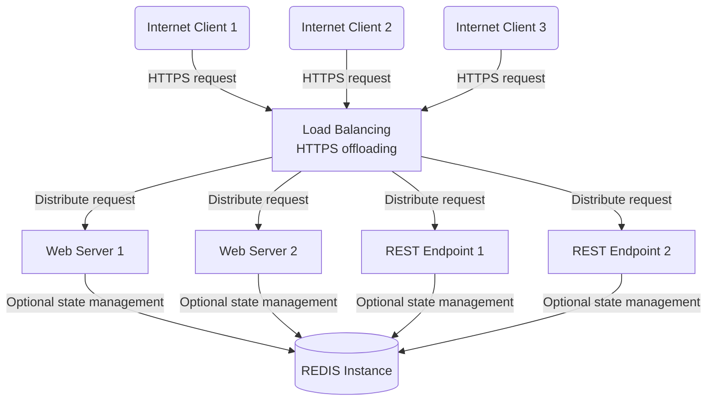
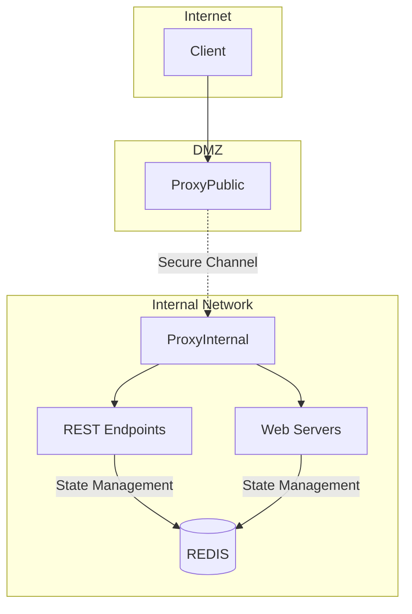
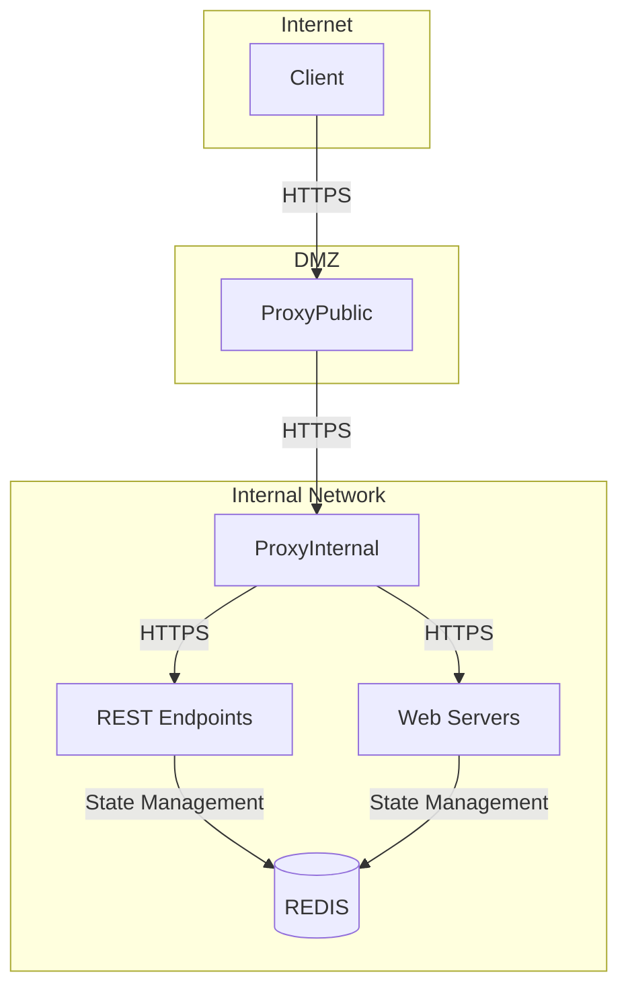
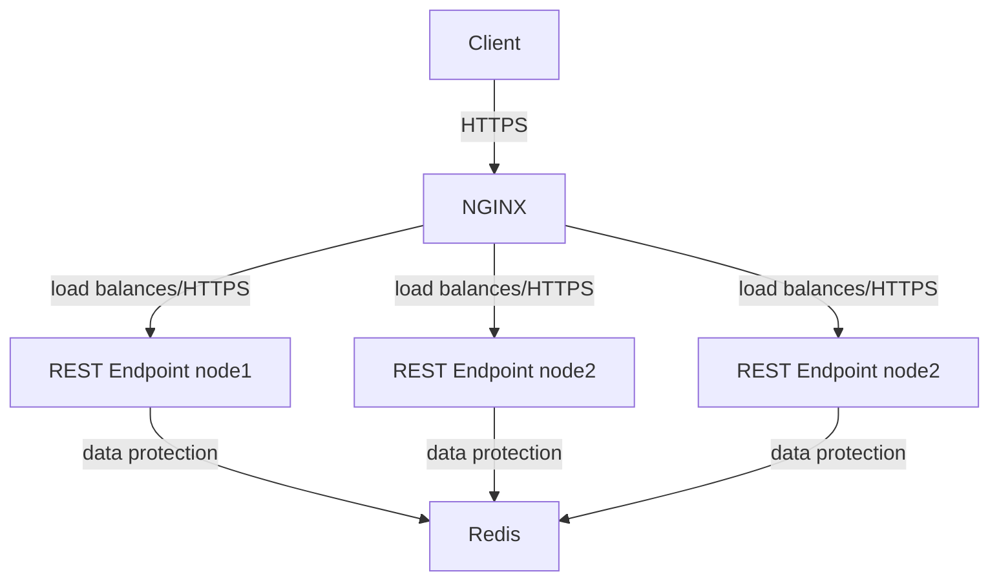
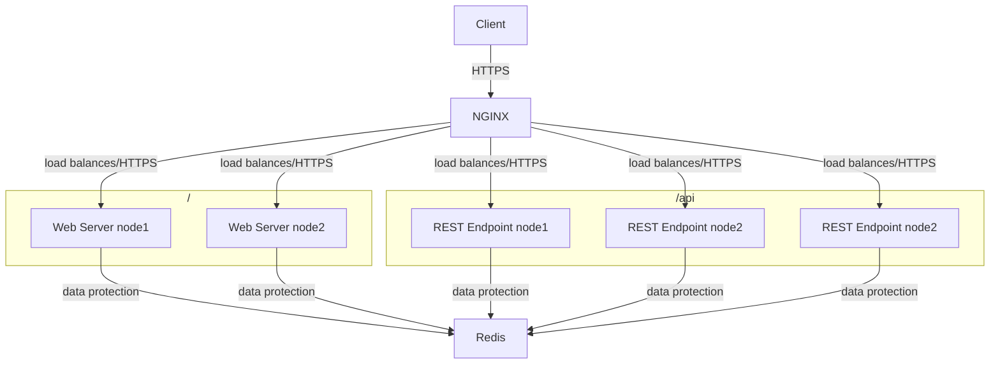
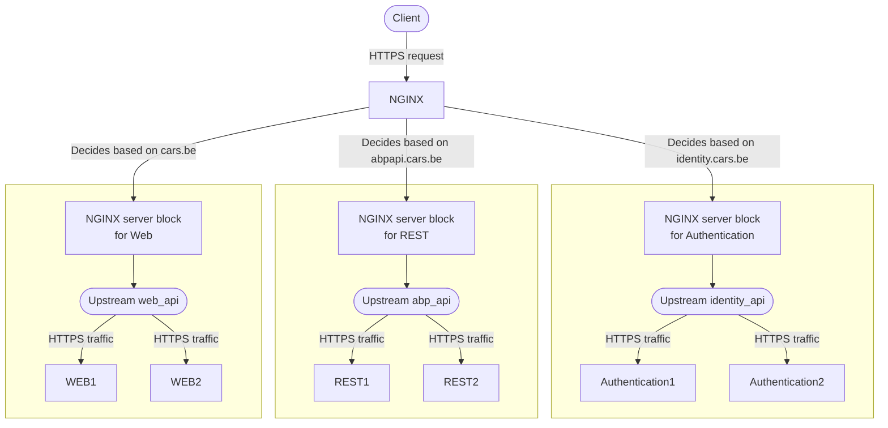

In the previous section, we explained how certificates are generated with our own CA. We can now use the certificates to encrypt internal traffic after offloading HTTPS traffic.

As we'd like to use HTTPS offloading and load balance the web server and REST endpoint, we migth choose a setup similar to:



Note that internal traffic (for example the Web Server querying the REST endpoint) runs over a publically acessible *proxy* and is not necessarily encrypted. Moreover, if the proxy acting as the HTTPS offloader and load balancer is compromised, an attacker could potentially gain access to both the unencrypted internal traffic routed through it and the encrypted traffic it decrypts, which makes it a critical point of security.  

Implementing a Demilitarized Zone (DMZ) is an approach to solve this: mitigate risks by segregating different parts of a network, hence, limiting the potential impact of a breach. A potential approach:  



From the diagram above, the segregation of both networks should be obvious: internal traffic is routed over `ProxyInternal` and not visible on (a breached) `ProxyPublic`.  

As the proxy acts as the entry point for incoming traffic, it can offload SSL/TLS for incoming HTTPS requests. The proxy decrypts the HTTPS traffic, re-encrypts the traffic and then routes the requests to the appropriate backend services. Backend services can - for instance - use certificates from an internal Certificate Authority (CA).  



:fire: TODO to configure a DMZ (firewall), we need some extra info:
| Source IP | Destination IP | Protocol (HTTPS TCP/443 or DNS UDP/53 or ...) |
|:---------:|:--------------:|:-----------------------------------------:|
| 192.168.51|192.168.1.60    |HTTPS TCP/443                              |

### NGINX

The proxy above may be implemented with different solutions:

* NGINX
* Traefik
* HAProxy
* Apache HTTP Server
* IIS
* Envoy Proxy
* Caddy
* F5
* ...

For this paricular setup, we will use NGINX.  

The following NGINX configuration demonstrates a setup designed to facilitate secure HTTPS connections to a load-balanced backend comprised of multiple HTTPS API servers:



The `NGINX` configuration for the following setup illustrates a setup for managing encrypted, load-balanced connections to a backend API cluster, with a focus on detailed logging, security with SSL, and flexibility to support large headers and optional WebSocket connections:  

```nginx
http {
    log_format upstreamlog '[$time_local] $remote_addr - $remote_user - $server_name $host to: $upstream_addr: $request $status upstream_response_time $upstream_response_time msec $msec request_time $request_time';

    upstream https_api {
        server 192.168.1.64:5000;
        server 192.168.1.68:5000;
        server 192.168.1.69:5000;
    }

    server {
        listen 443 ssl;
        listen [::]:443 ssl;
        include snippets/self-signed.conf;
        include snippets/ssl-params.conf;

        client_header_buffer_size 4k;
        large_client_header_buffers 4 8k; # Increase if JWT or other headers are large      

        access_log /var/log/nginx/access.log upstreamlog;

        # The location ^~ /api/ block captures all requests starting with /api/ and forwards them to the https_api upstream. The ^~ modifier gives this location precedence over regular expression locations that might also match.
        location ^~ /api/ {
            # The proxy_pass https://https_api; directive tells NGINX to forward the requests to the defined upstream group https_api. Ensure the scheme (https://) matches your upstream configuration. If your upstream servers are configured with HTTP, change the scheme accordingly.
            proxy_pass https://https_api;

            # Header adjustments are defined inside the /api/ location block to ensure they're applied only to the proxied requests.          
            proxy_set_header Host $host;
            proxy_set_header X-Real-IP $remote_addr;
            proxy_set_header X-Forwarded-For $proxy_add_x_forwarded_for;
            proxy_set_header X-Forwarded-Proto $scheme;
            proxy_set_header Authorization $http_authorization;

            # Additional necessary proxy settings
        }

        # The location / block is modified to return a 404 error for any requests that don't match the /api/ path. This effectively drops traffic not intended for the API.        
        location / {
            return 404;
        }

      # Optional: Redirect the root path specifically if necessary
      # location = / {
      #     return 404;
      # }
        
      # Other possible headers you might want to set
      # proxy_set_header Authorization ""; # If you need to reset the Authorization header

      # WebSocket support (if needed)
      # proxy_http_version 1.1;
      # proxy_set_header Upgrade $http_upgrade;
      # proxy_set_header Connection "upgrade";
    }
}
```

If we'd like to include the web servers in the diagram and configured as above, we get a diagram like:



and an NGINX config:

```nginx
http {
    log_format upstreamlog '[$time_local] $remote_addr - $remote_user - $server_name $host to: $upstream_addr: $request $status upstream_response_time $upstream_response_time msec $msec request_time $request_time';

    upstream https_api {
        server 192.168.1.64:5000;
        server 192.168.1.68:5000;
        server 192.168.1.69:5000;
    }

    upstream web_api {
        server 192.168.1.60:5000;
        server 192.168.1.61:5000;
    }

    server {
        listen 443 ssl;
        listen [::]:443 ssl;
        # The server_name directive specifies cars.be as the domain this server block will respond to, also for /api/!
        server_name cars.be;

        include snippets/self-signed.conf;
        include snippets/ssl-params.conf;

        client_header_buffer_size 4k;
        large_client_header_buffers 4 8k; # Increase if JWT or other headers are large      

        access_log /var/log/nginx/access.log upstreamlog;

        # Serve the website for cars.be except for paths under /api/
        location / {
            proxy_pass https://web_api/
        }

        # The location ^~ /api/ block captures all requests starting with /api/ and forwards them to the https_api upstream. The ^~ modifier gives this location precedence over regular expression locations that might also match.
        location ^~ /api/ {
            # The proxy_pass https://https_api; directive tells NGINX to forward the requests to the defined upstream group https_api. Ensure the scheme (https://) matches your upstream configuration. If your upstream servers are configured with HTTP, change the scheme accordingly.
            proxy_pass https://https_api;

            # Header adjustments are defined inside the /api/ location block to ensure they're applied only to the proxied requests.          
            proxy_set_header Host $host;
            proxy_set_header X-Real-IP $remote_addr;
            proxy_set_header X-Forwarded-For $proxy_add_x_forwarded_for;
            proxy_set_header X-Forwarded-Proto $scheme;
            proxy_set_header Authorization $http_authorization;

            # Additional necessary proxy settings
        }

        # The location / block is modified to return a 404 error for any requests that don't match the /api/ path. This effectively drops traffic not intended for the API.        
        location / {
            return 404;
        }

      # Optional: Redirect the root path specifically if necessary
      # location = / {
      #     return 404;
      # }
        
      # Other possible headers you might want to set
      # proxy_set_header Authorization ""; # If you need to reset the Authorization header

      # WebSocket support (if needed)
      # proxy_http_version 1.1;
      # proxy_set_header Upgrade $http_upgrade;
      # proxy_set_header Connection "upgrade";
    }
}
```

The configuration above now serves a website for requests to cars.be on port 443 with HTTPS, except for HTTPS requests to cars.be/api/, which are proxied to the upstream https_api.  

As mentioned, the public certificate may be delivered by Let's Encrypt. If we'd like to automatically request/renew certificates, Let's Encrypt will need to check that we are the owners of our domain (cars.be in this example). Let's Encrypt executes such a test by requesting a special file from the http://domain/.well-known/acme-challenge directory. `certbot` Is the most common client for Let's Enrypt to *generate this special file*.  

```nginx
http {
    log_format upstreamlog '[$time_local] $remote_addr - $remote_user - $server_name $host to: $upstream_addr: $request $status upstream_response_time $upstream_response_time msec $msec request_time $request_time';

    upstream https_api {
        server 192.168.1.64:5000;
        server 192.168.1.68:5000;
        server 192.168.1.69:5000;
    }

    upstream web_api {
        server 192.168.1.60:5000;
        server 192.168.1.61:5000;
    }

    server {
        listen 80;
        server_name cars.be;

        location /.well-known/acme-challenge/ {
            root /var/www/letsencrypt;
            allow all;
        }

        location / {
            return 301 https://$host$request_uri;
        }
    }

    server {
        listen 443 ssl;
        listen [::]:443 ssl;
        # The server_name directive specifies cars.be as the domain this server block will respond to, also for /api/!
        server_name cars.be;

        include snippets/self-signed.conf;
        include snippets/ssl-params.conf;

        client_header_buffer_size 4k;
        large_client_header_buffers 4 8k; # Increase if JWT or other headers are large      

        access_log /var/log/nginx/access.log upstreamlog;

        # Serve the website for cars.be except for paths under /api/
        location / {
            proxy_pass https://web_api/;
        }

        # The location ^~ /api/ block captures all requests starting with /api/ and forwards them to the https_api upstream. The ^~ modifier gives this location precedence over regular expression locations that might also match.
        location ^~ /api/ {
            # The proxy_pass https://https_api; directive tells NGINX to forward the requests to the defined upstream group https_api. Ensure the scheme (https://) matches your upstream configuration. If your upstream servers are configured with HTTP, change the scheme accordingly.
            proxy_pass https://https_api;

            # Header adjustments are defined inside the /api/ location block to ensure they're applied only to the proxied requests.          
            proxy_set_header Host $host;
            proxy_set_header X-Real-IP $remote_addr;
            proxy_set_header X-Forwarded-For $proxy_add_x_forwarded_for;
            proxy_set_header X-Forwarded-Proto $scheme;
            proxy_set_header Authorization $http_authorization;

            # Additional necessary proxy settings
        }
        
      # Other possible headers you might want to set
      # proxy_set_header Authorization ""; # If you need to reset the Authorization header

      # WebSocket support (if needed)
      # proxy_http_version 1.1;
      # proxy_set_header Upgrade $http_upgrade;
      # proxy_set_header Connection "upgrade";
    }
}
```

In the NGINX configuration examples above, the routing of traffic is based on URLs, if we route traffic based on server names we get the following representation:



For our particular setup, this becomes:

```nginx
events {
}

http {

    client_header_buffer_size 4k;
    #large_client_header_buffers 4 8k; # Increase if JWT or other headers are large      
    proxy_buffer_size   128k;
    proxy_buffers   4 256k;
    proxy_busy_buffers_size   256k;
    large_client_header_buffers 4 16k;

    log_format upstreamlog '[$time_local] $remote_addr - $remote_user - $server_name $host to: $upstream_addr: $request $status upstream_response_time $upstream_response_time msec $msec request_time $request_time';

    upstream abp_api {
        
        server {{ host }}:{{ hostvars[host]['service_port'] }};
        
    }

    upstream web_api {        
        
        server {{ host }}:{{ hostvars[host]['service_port'] }};
        
    }

    upstream identity_api {        
        
        server {{ host }}:{{ hostvars[host]['service_port'] }};
        
    }

    server {
        listen 443 ssl;
        listen [::]:443 ssl;
        # The server_name directive specifies cars.be as the domain this server block will respond to, also for /api/!
        server_name identity.{{ project_domain }};

        include snippets/self-signed.conf;
        include snippets/ssl-params.conf;

        access_log /var/log/nginx/access.log upstreamlog;

        # Serve the website for identity.cars.be
        location / {
            proxy_pass https://identity_api/;

            # Header adjustments are defined inside the /api/ location block to ensure they're applied only to the proxied requests.          
            proxy_set_header Host $host;
            proxy_set_header X-Real-IP $remote_addr;
            proxy_set_header X-Forwarded-For $proxy_add_x_forwarded_for;
            proxy_set_header X-Forwarded-Proto $scheme;
            proxy_set_header Authorization $http_authorization;

            # Additional necessary proxy settings
        }    
    }

    server {
        listen 443 ssl;
        listen [::]:443 ssl;
        # The server_name directive specifies cars.be as the domain this server block will respond to, also for /api/!
        server_name abpapi.{{ project_domain }};

        include snippets/self-signed.conf;
        include snippets/ssl-params.conf;

        access_log /var/log/nginx/access.log upstreamlog;

        # Serve the website for identity.cars.be
        location / {
            proxy_pass https://abp_api/;

            # Header adjustments are defined inside the /api/ location block to ensure they're applied only to the proxied requests.          
            proxy_set_header Host $host;
            proxy_set_header X-Real-IP $remote_addr;
            proxy_set_header X-Forwarded-For $proxy_add_x_forwarded_for;
            proxy_set_header X-Forwarded-Proto $scheme;
            proxy_set_header Authorization $http_authorization;

            # Additional necessary proxy settings
        }    
    }

    server {
        listen 443 ssl;
        listen [::]:443 ssl;
        # The server_name directive specifies cars.be as the domain this server block will respond to, also for /api/!
        server_name {{ project_domain }};

        include snippets/self-signed.conf;
        include snippets/ssl-params.conf;

        access_log /var/log/nginx/access.log upstreamlog;

        # Serve the website for cars.be except for paths under /api/
        location / {
            proxy_pass https://web_api/;

            # Header adjustments are defined inside the /api/ location block to ensure they're applied only to the proxied requests.          
            proxy_set_header Host $host;
            proxy_set_header X-Real-IP $remote_addr;
            proxy_set_header X-Forwarded-For $proxy_add_x_forwarded_for;
            proxy_set_header X-Forwarded-Proto $scheme;
            proxy_set_header Authorization $http_authorization;

            # Additional necessary proxy settings
        }        
        
      # Other possible headers you might want to set
      # proxy_set_header Authorization ""; # If you need to reset the Authorization header

      # WebSocket support (if needed)
      proxy_http_version 1.1;
      proxy_set_header Upgrade $http_upgrade;
      proxy_set_header Connection "upgrade";
    }
}
```

As routing based on hostnames has less impact on the web server and REST endpoint source code (no constraints on URLS), routing based on hostnames is the preferred solution in this project.  

#### Log format

To capture detailed information about requests and responses, we define a custom logging format: the `log_format` directive specifies a custom format named `upstreamlog`, which includes *timestamps, client IP, the requested server name and host, the upstream server address that handled the request, the request details, status code, response times, and request processing times*. This detailed logging is crucial for debugging and monitoring the performance of the upstream servers, in particular inspecting load balancing as the log will display the IP address of the upstream REST API node.

#### Load balancing

Distribute incoming traffic across multiple backend servers: the upstream block named `http_api` defines a cluster of servers (with specified IP addresses and port numbers) that requests will be load balanced across. This setup increases the application's scalability and reliability by distributing the load and providing redundancy.

#### HTTPS configuration

We configure NGINX to serve HTTPS traffic and to use specific SSL parameters and certificates.

* The **listen 443 ssl directives** instruct NGINX to listen for incoming connections on port 443 with SSL encryption, including IPv6 connections ([::]:443 ssl).
* The **include directives** incorporate additional SSL configurations and self-signed certificate details from external files (self-signed.conf and ssl-params.conf), modularizing the SSL setup for easier management.
* client_header_buffer_size And large_client_header_buffers directives adjust the buffer sizes for client request headers, accommodating potentially large JWT tokens or other large headers.

Note the HTTPS offloading and re-encryption in the configuration above which involves the NGINX server acting as a termination point for incoming HTTPS connections from clients. NGINX decrypts these connections, inspects the traffic, and then re-encrypts the traffic before forwarding it to the backend servers over HTTPS using separate, internal SSL certificates. This process allows for secure communication both externally with clients and internally within the data center:

* **Decryption of Incoming HTTPS Requests**: NGINX uses public-facing SSL certificates to decrypt data received over SSL/TLS from clients. This is the offloading part.
* **Inspection and Processing**: Once decrypted, NGINX can inspect, log, or manipulate the HTTP content as necessary. This step can involve modifying headers, applying access controls, or making routing decisions.
* **Re-Encryption and Forwarding**: NGINX then re-encrypts the requests using internal SSL certificates and forwards them to the backend servers over HTTPS. This ensures that traffic remains secure as it traverses the internal network.
* **Secure Internal Communication**: The backend servers, configured with the internal certificates, decrypt the re-encrypted requests, process them, and send back the responses. NGINX then encrypts the responses again (if necessary) before sending them back to the clients.

HTTPS offloading and re-encryption has the following benefits:

* **Enhanced Security Across the Board**: This setup ensures end-to-end encryption of data, maintaining security from the client to the NGINX server and from the NGINX server to the backend servers. Using internal certificates for the data center adds an extra layer of security within the internal network.
* **Centralized Public SSL Management**: Public-facing SSL certificate management remains centralized at the NGINX server, simplifying the administration of public encryption keys and certificates.
* **Flexible Trust and Security Policies**: The separation of external and internal certificates allows for distinct trust domains and security policies. For example, stronger or different encryption standards can be applied internally compared to what is used for public internet traffic.
* **Inspection and Added Controls**: Decrypting the traffic at the NGINX layer allows for detailed inspection and the application of additional security controls before re-encrypting and sending it to backend services. This can be crucial for compliance with security policies, logging, or performing deep packet inspection for threat detection.
* **Performance and Scalability**: While the NGINX server handles the computational overhead of encrypting and decrypting traffic twice, it offloads backend servers from doing so. This can be optimized by using hardware that accelerates SSL processing. Furthermore, it allows backend servers to be scaled out without the need to manage public SSL certificates on each of them.
* **Secure Internal Traffic**: Using HTTPS internally protects against potential threats lurking within the data center, ensuring that sensitive data is encrypted in transit even within the network's trusted boundaries.

In summary, employing HTTPS offloading and re-encryption with NGINX provides robust security by ensuring encrypted traffic both externally and internally while centralizing certificate management and offering the ability to inspect and manipulate HTTP traffic. This configuration enhances the overall security posture and flexibility of managing traffic flows within distributed application architectures.

#### Access logging

In orde to use a custom-defined log file path and format, the `access_log` directive specifies the path to the access log file and instructs NGINX to use the *upstreamlog* format (`log_format upstreamlog '[$ti...`) for logging, ensuring that detailed information about each request and its handling is logged for future analysis.

#### Location block and proxy settings

Request routing and proxying behavior for the root path is defined with:

* The **location / block** matches all requests and uses the proxy_pass directive to forward them to the http_api upstream cluster, enabling load balancing.
* The **proxy_set_header directives** modify request headers to include the original host, the real client IP address, and the protocol used, ensuring that the proxied requests contain necessary information for backend services to process them correctly.
* The configuration optionally supports **forwarding the Authorization header**, preserving JWT or other authentication tokens needed by the backend services.

#### Optional websocket support

This part of the configuration provides the necessary headers to support WebSocket connections if needed:

* The commented-out directives (`proxy_http_version`, `proxy_set_header Upgrade`, and `proxy_set_header Connection`) are set up to enable WebSocket support, ensuring that NGINX can proxy WebSocket connections correctly. These lines can be uncommented and adjusted as needed based on the application's requirements.
